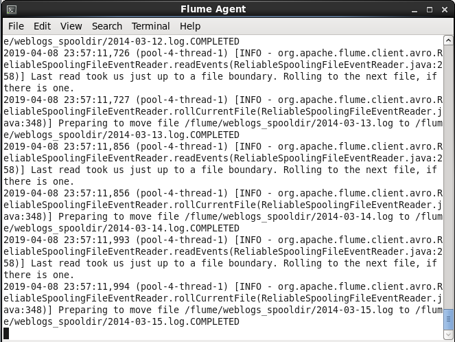
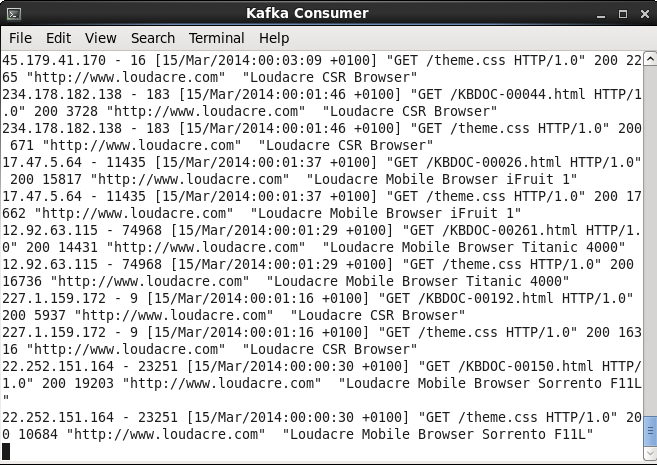

# Flafka Exercise

### 1. Review the configuration file. You do not need to edit this file. Take note in particular of the following points:
```
[training@localhost ~]$ cat $DEVSH/exercises/flafka/spooldir_kafka.conf
# spooldir_kafka.conf: A Spooling Directory Source with a Kafka Sink

# Name the components on this agent
agent1.sources = webserver-log-source
agent1.sinks = kafka-sink
agent1.channels = memory-channel

# Configure the source
agent1.sources.webserver-log-source.type = spooldir
agent1.sources.webserver-log-source.spoolDir = /flume/weblogs_spooldir
agent1.sources.webserver-log-source.channels = memory-channel

# Configure the sink
agent1.sinks.kafka-sink.type = org.apache.flume.sink.kafka.KafkaSink
agent1.sinks.kafka-sink.topic = weblogs
agent1.sinks.kafka-sink.brokerList = localhost:9092
agent1.sinks.kafka-sink.batchSize = 20
agent1.sinks.kafka-sink.channel = memory-channel


# Use a channel which buffers events in memory
agent1.channels.memory-channel.type = memory
agent1.channels.memory-channel.capacity = 100000
agent1.channels.memory-channel.transactionCapacity = 1000
```


### 2. Start the Flume agent on the gateway node using the configuration you just reviewed:
```
[training@localhost ~]$ flume-ng agent --conf /etc/flume-ng/conf \
> --conf-file $DEVSH/exercises/flafka/spooldir_kafka.conf \
> --name agent1 -Dflume.root.logger=INFO,console
```


### 3. Wait a few moments for the Flume agent to start up. You will see a message like: Component type: SINK, name: kafka-sink started


### 4. In a new gateway terminal window, start a Kafka consumer that will read from the weblogs topic:
```
[training@localhost ~]$ kafka-console-consumer \
> --zookeeper localhost:2181 \
> --topic weblogs
```


### 5. In a separate new gateway terminal window, run the script to place the web log files in the /flume/weblogs_spooldir directory:
```
[training@localhost ~]$ ~/training_materials/devsh/exercises/flafka/copy-move-weblogs.sh \
> /flume/weblogs_spooldir
/flume/weblogs_spooldir exists and is not empty, delete contents? (y/n)
y
Copying and moving files to /flume/weblogs_spooldir
```


### 6. In the terminal that is running the Flume agent, watch the logging output. The output will give information about the files Flume is ingesting from the source directory.


### 7. In the terminal that is running the Kafka consumer, confirm that the consumer tool is displaying each message (that is, each line of the web log file Flume is ingesting).


### 8. Once the Flume agent has finished, enter Ctrl+C in both the Flume agent terminal and the Kafka consumer terminal to end their respective processes.


