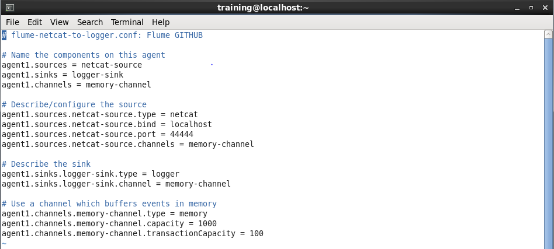
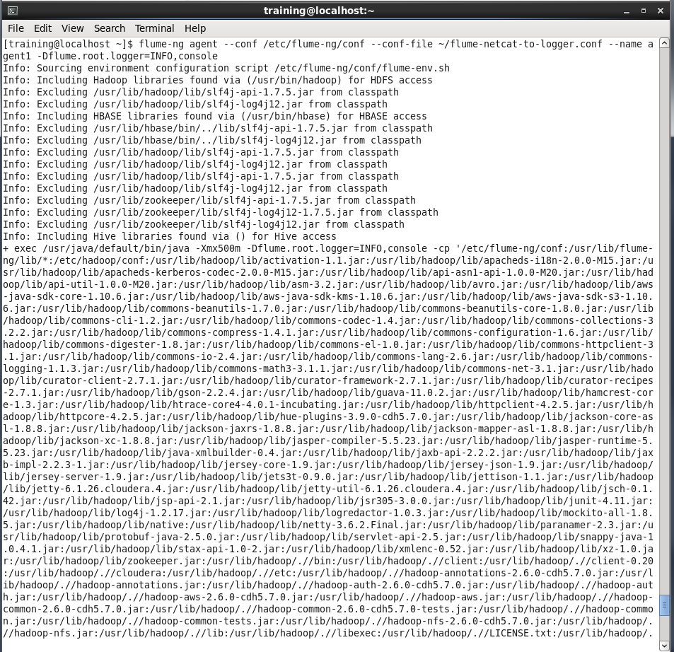
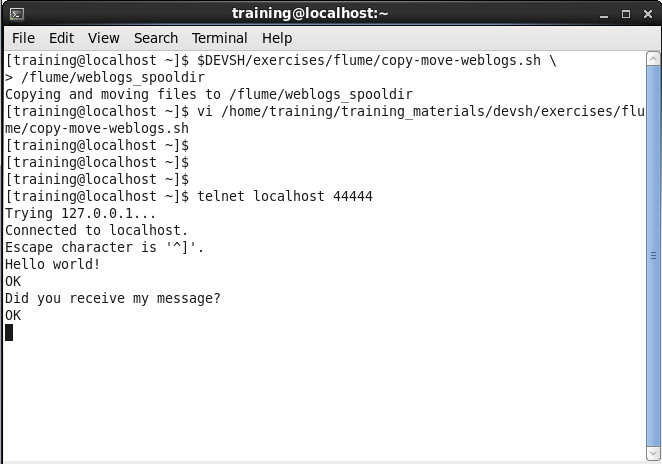
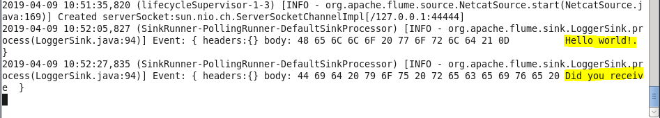

# Flume Exercise

### 1. Create a new flume configuration file with the following
```
# flume-netcat-to-logger.conf: Flume GITHUB

# Name the components on this agent
agent1.sources = netcat-source
agent1.sinks = logger-sink
agent1.channels = memory-channel

# Describe/configure the source
agent1.sources.netcat-source.type = netcat
agent1.sources.netcat-source.bind = localhost
agent1.sources.netcat-source.port = 44444
agent1.sources.netcat-source.channels = memory-channel

# Describe the sink
agent1.sinks.logger-sink.type = logger
agent1.sinks.logger-sink.channel = memory-channel

# Use a channel which buffers events in memory
agent1.channels.memory-channel.type = memory
agent1.channels.memory-channel.capacity = 1000
agent1.channels.memory-channel.transactionCapacity = 100
```


### 2. Start the agent.
```
[training@localhost ~]$ flume-ng agent --conf /etc/flume-ng/conf --conf-file ~/flume-netcat-to-logger.conf --name agent1 -Dflume.root.logger=INFO,console
```


### 3. From another terminal start telnet and connect to port 4444. Start typing and you should see the results from the other terminal. Provide a screenshot of your results.
```
[training@localhost ~]$ telnet localhost 44444
Trying 127.0.0.1...
Connected to localhost.
Escape character is '^]'.
Hello world!
OK
Did you receive my message?
OK
```



