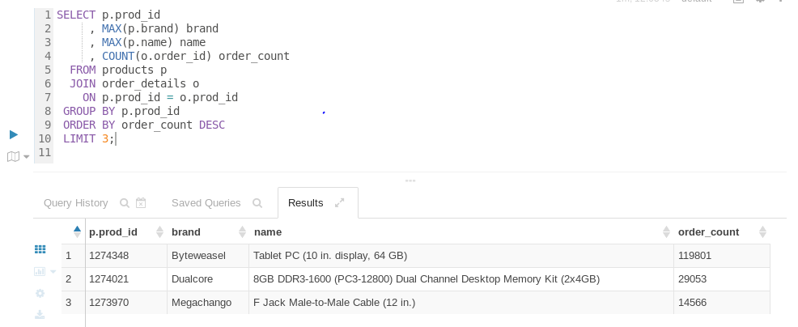
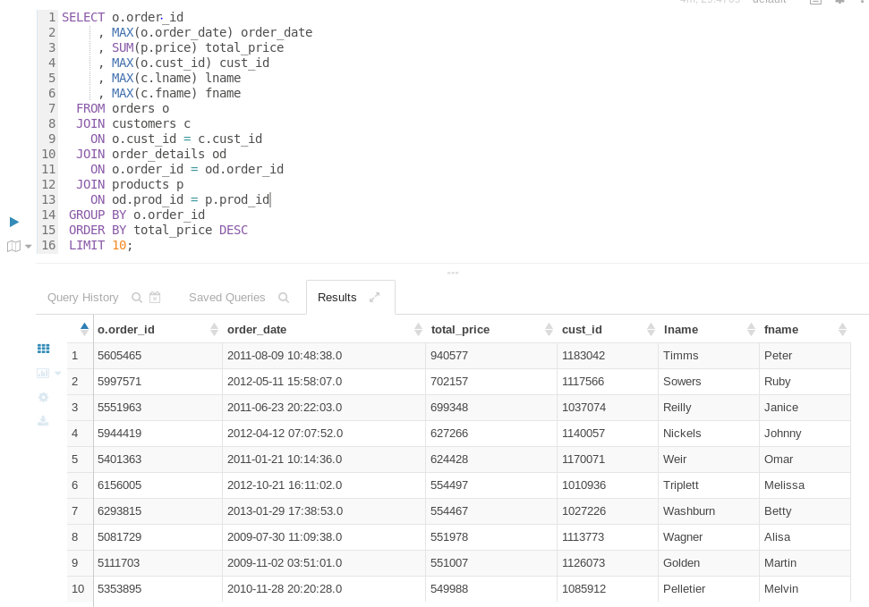
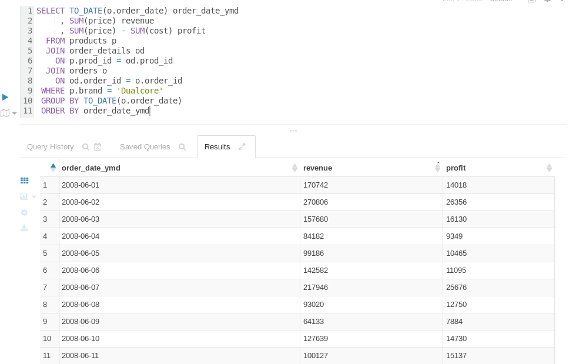

# Hive Exercise

### Calculating the Top N Products
Which top three products have been sold more than any other products?
```
SELECT p.prod_id
     , MAX(p.brand) brand
     , MAX(p.name) name
     , COUNT(o.order_id) order_count
  FROM products p
  JOIN order_details o
    ON p.prod_id = o.prod_id
 GROUP BY p.prod_id
 ORDER BY order_count DESC
 LIMIT 3;
```


### Calculating the Order Total
Which ten orders had the highest total dollar amounts?
```
SELECT o.order_id
     , MAX(o.order_date) order_date
     , SUM(p.price) total_price
     , MAX(o.cust_id) cust_id
     , MAX(c.lname) lname
     , MAX(c.fname) fname
  FROM orders o
  JOIN customers c
    ON o.cust_id = c.cust_id
  JOIN order_details od
    ON o.order_id = od.order_id
  JOIN products p
    ON od.prod_id = p.prod_id
 GROUP BY o.order_id
 ORDER BY total_price DESC
 LIMIT 10;
```


### Calculating Revenue and Profit
Run a query to show Dualcore's revenue(total price of products sold) and profit(price minus cost) by date
```
SELECT TO_DATE(o.order_date) order_date_ymd
     , SUM(price) revenue
     , SUM(price) - SUM(cost) profit
  FROM products p
  JOIN order_details od
    ON p.prod_id = od.prod_id
  JOIN orders o
    ON od.order_id = o.order_id
 WHERE p.brand = 'Dualcore'
 GROUP BY TO_DATE(o.order_date)
 ORDER BY order_date_ymd
```


### Bonus Exercise 1: Ranking Daily Profits by Month
Run a query to show how each day's profit ranks compared to other days within the same year and month
```
SELECT order_date_ymd
     , profit
     , ROW_NUMBER() OVER (PARTITION BY YEAR(order_date_ymd), MONTH(order_date_ymd) ORDER BY profit DESC) rank
  FROM (
        SELECT TO_DATE(o.order_date) order_date_ymd
             , SUM(price) - SUM(cost) profit
          FROM products p
          JOIN order_details od
            ON p.prod_id = od.prod_id
          JOIN orders o
            ON od.order_id = o.order_id
         WHERE p.brand = 'Dualcore'
         GROUP BY TO_DATE(o.order_date)
       ) tmp
 ORDER BY order_date_ymd;
```
