# Kafka Exercise

### 1. Open a new gateway terminal window on your Get2Cluster remote desktop and create a Kafka topic named weblogs that will contain messages representing lines in Loudacre’s web server logs.
```
[training@localhost ~]$ kafka-topics -create \
> --zookeeper localhost:2181 \
> --replication-factor 1 \
> --partitions 1 \
> --topic weblogs
Created topic "weblogs".
```
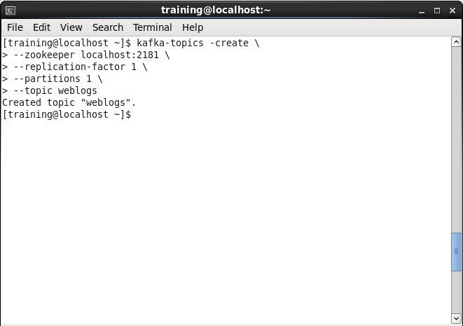

### 2. Display all Kafka topics to confirm that the new topic you just created is listed:
```
[training@localhost ~]$ kafka-topics -list \
> --zookeeper localhost:2181
weblogs
```
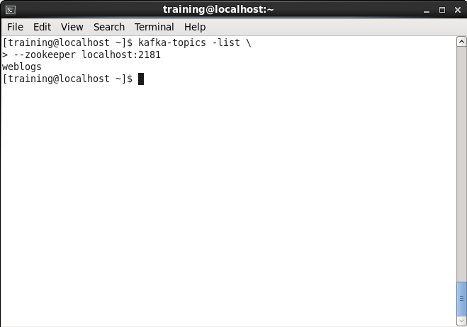

### 3. Review the details of the weblogs topic.
```
[training@localhost ~]$ kafka-topics --describe weblogs \
> --zookeeper localhost:2181
Topic:weblogs	PartitionCount:1	ReplicationFactor:1	Configs:
	Topic: weblogs	Partition: 0	Leader: 0	Replicas: 0	Isr: 0
```
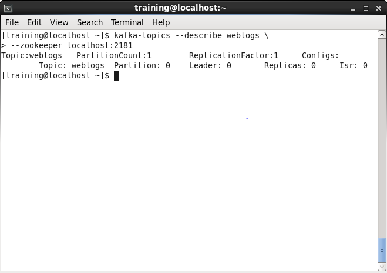

### 4. Start a Kafka producer for the weblogs topic:
```
[training@localhost ~]$ kafka-console-producer \
> --broker-list localhost:9092 \
> --topic weblogs
```
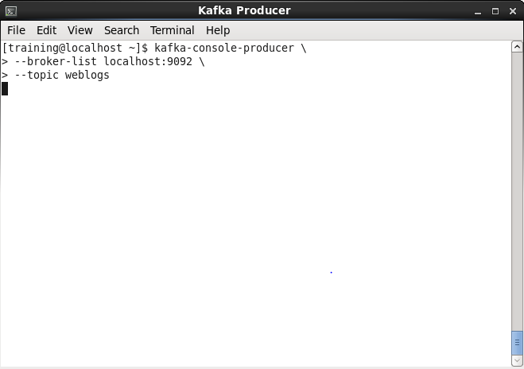

### 5. Publish a test message to the weblogs topic by typing the message text and then pressing Enter. For example:
```
[training@localhost ~]$ kafka-console-producer \
> --broker-list localhost:9092 \
> --topic weblogs
test weblog entry 1
```
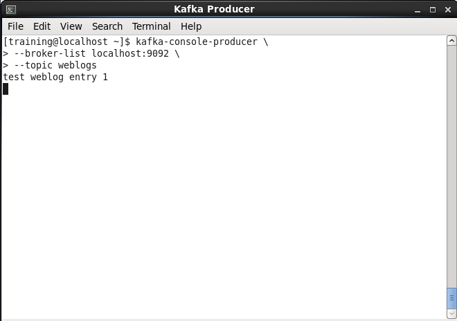

### 6. Open a new terminal window and adjust it to fit on the window beneath the producer window. Set the title for this window to “Kafka Consumer.”
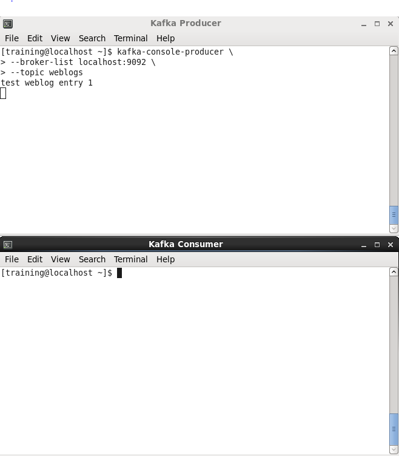

### 7. In the new gateway terminal window, start a Kafka consumer that will read from the beginning of the weblogs topic:
```
[training@localhost ~]$ kafka-console-consumer \
> --zookeeper localhost:2181 \
> --topic weblogs \
> --from-beginning
test weblog entry 1
test weblog entry 1
```
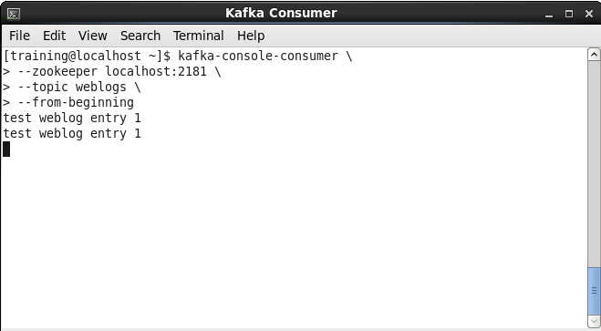

### 8. Press Ctrl+C to stop the weblogs consumer, and restart it, but this time omit the --from-beginning option to this command. You should see that no messages are displayed.
```
[training@localhost ~]$ kafka-console-consumer \
> --zookeeper localhost:2181 \
> --topic weblogs \
> --from-beginning
test weblog entry 1
test weblog entry 1
^CProcessed a total of 2 messages
[training@localhost ~]$ kafka-console-consumer \
> --zookeeper localhost:2181 \
> --topic weblogs
```
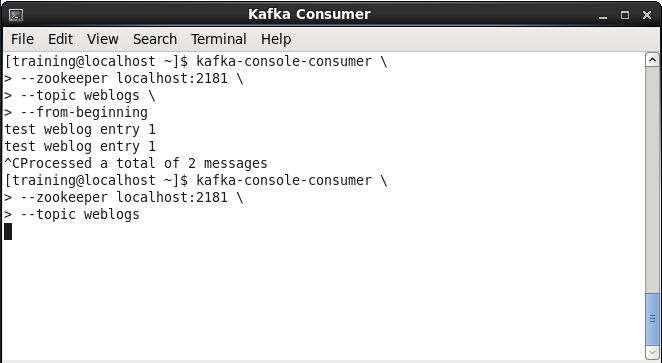

### 9. Switch back to the producer window and type another test message into the terminal, followed by the Enter key:
```
[training@localhost ~]$ kafka-console-producer \
> --broker-list localhost:9092 \
> --topic weblogs
test weblog entry 1
test weblog entry 2
```
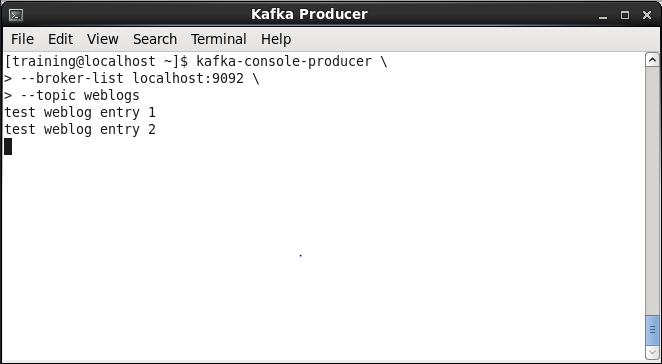

### 10. Return to the consumer window and verify that it now displays the alert message you published from the producer in the previous step.
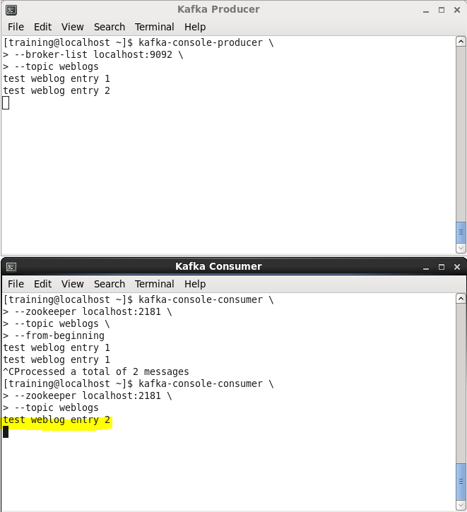

### 11. Press Ctrl+C in the consumer terminal window to end its process.
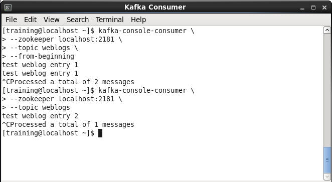

### 12. Press Ctrl+C in the producer terminal window to end its process.
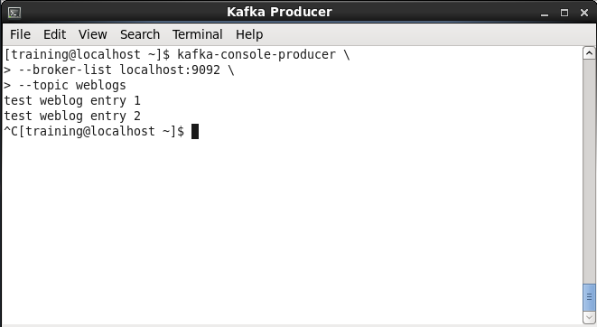
