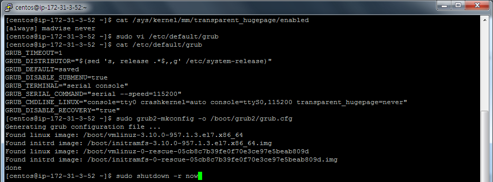
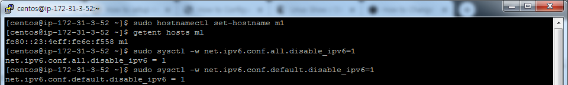

## CM Install Lab
### System Configuration Checks
Using the steps below, verify that all instances are ready. You must modify them when necessary, which includes installing missing packages and changing kernel tunables or other system settings.

You only need to show this work for one of the instances, but you will run into trouble later on if you don't complete this work on all of them.

  1. Check vm.swappiness on all your nodes
    - Set the value to 1 if necessary
```
[centos@ip-172-31-3-52 ~]$ cat /proc/sys/vm/swappiness
30
[centos@ip-172-31-3-52 ~]$ sudo sysctl -w vm.swappiness=1
vm.swappiness = 1
[centos@ip-172-31-3-52 ~]$ cat /proc/sys/vm/swappiness
1
```

```
[centos@ip-172-31-3-52 ~]$ sudo vi /etc/sysctl.conf
[centos@ip-172-31-3-52 ~]$ cat /etc/sysctl.conf
# sysctl settings are defined through files in
# /usr/lib/sysctl.d/, /run/sysctl.d/, and /etc/sysctl.d/.
#
# Vendors settings live in /usr/lib/sysctl.d/.
# To override a whole file, create a new file with the same in
# /etc/sysctl.d/ and put new settings there. To override
# only specific settings, add a file with a lexically later
# name in /etc/sysctl.d/ and put new settings there.
#
# For more information, see sysctl.conf(5) and sysctl.d(5).
vm.swappiness = 1
```

  2. Show the mount attributes of your volume(s)
```
[centos@ip-172-31-3-52 ~]$ cat /proc/mounts
rootfs / rootfs rw 0 0
sysfs /sys sysfs rw,seclabel,nosuid,nodev,noexec,relatime 0 0
proc /proc proc rw,nosuid,nodev,noexec,relatime 0 0
devtmpfs /dev devtmpfs rw,seclabel,nosuid,size=7872836k,nr_inodes=1968209,mode=755 0 0
securityfs /sys/kernel/security securityfs rw,nosuid,nodev,noexec,relatime 0 0
tmpfs /dev/shm tmpfs rw,seclabel,nosuid,nodev 0 0
devpts /dev/pts devpts rw,seclabel,nosuid,noexec,relatime,gid=5,mode=620,ptmxmode=000 0 0
tmpfs /run tmpfs rw,seclabel,nosuid,nodev,mode=755 0 0
tmpfs /sys/fs/cgroup tmpfs ro,seclabel,nosuid,nodev,noexec,mode=755 0 0
cgroup /sys/fs/cgroup/systemd cgroup rw,seclabel,nosuid,nodev,noexec,relatime,xattr,release_agent=/usr/lib/systemd/systemd-cgroups-agent,name=systemd 0 0
pstore /sys/fs/pstore pstore rw,nosuid,nodev,noexec,relatime 0 0
cgroup /sys/fs/cgroup/blkio cgroup rw,seclabel,nosuid,nodev,noexec,relatime,blkio 0 0
cgroup /sys/fs/cgroup/net_cls,net_prio cgroup rw,seclabel,nosuid,nodev,noexec,relatime,net_prio,net_cls 0 0
cgroup /sys/fs/cgroup/pids cgroup rw,seclabel,nosuid,nodev,noexec,relatime,pids 0 0
cgroup /sys/fs/cgroup/freezer cgroup rw,seclabel,nosuid,nodev,noexec,relatime,freezer 0 0
cgroup /sys/fs/cgroup/perf_event cgroup rw,seclabel,nosuid,nodev,noexec,relatime,perf_event 0 0
cgroup /sys/fs/cgroup/cpu,cpuacct cgroup rw,seclabel,nosuid,nodev,noexec,relatime,cpuacct,cpu 0 0
cgroup /sys/fs/cgroup/hugetlb cgroup rw,seclabel,nosuid,nodev,noexec,relatime,hugetlb 0 0
cgroup /sys/fs/cgroup/cpuset cgroup rw,seclabel,nosuid,nodev,noexec,relatime,cpuset 0 0
cgroup /sys/fs/cgroup/devices cgroup rw,seclabel,nosuid,nodev,noexec,relatime,devices 0 0
cgroup /sys/fs/cgroup/memory cgroup rw,seclabel,nosuid,nodev,noexec,relatime,memory 0 0
configfs /sys/kernel/config configfs rw,relatime 0 0
/dev/nvme0n1p1 / xfs rw,seclabel,relatime,attr2,inode64,noquota 0 0
rpc_pipefs /var/lib/nfs/rpc_pipefs rpc_pipefs rw,relatime 0 0
selinuxfs /sys/fs/selinux selinuxfs rw,relatime 0 0
systemd-1 /proc/sys/fs/binfmt_misc autofs rw,relatime,fd=21,pgrp=1,timeout=0,minproto=5,maxproto=5,direct,pipe_ino=13091 0 0
debugfs /sys/kernel/debug debugfs rw,relatime 0 0
hugetlbfs /dev/hugepages hugetlbfs rw,seclabel,relatime 0 0
mqueue /dev/mqueue mqueue rw,seclabel,relatime 0 0
tmpfs /run/user/0 tmpfs rw,seclabel,nosuid,nodev,relatime,size=1579140k,mode=700 0 0
tmpfs /run/user/1000 tmpfs rw,seclabel,nosuid,nodev,relatime,size=1579140k,mode=700,uid=1000,gid=1000 0 0
```

  3. If you have ext-based volumes, list the reserve space setting
    - XFS volumes do not support reserve space
```
[centos@ip-172-31-3-52 ~]$ cat /etc/fstab
#
# /etc/fstab
# Created by anaconda on Mon Jan 28 20:51:49 2019
#
# Accessible filesystems, by reference, are maintained under '/dev/disk'
# See man pages fstab(5), findfs(8), mount(8) and/or blkid(8) for more info
#
UUID=f41e390f-835b-4223-a9bb-9b45984ddf8d /                       xfs     defaults        0 0
```

  4. Disable transparent hugepage support
```
[centos@ip-172-31-3-52 ~]$ cat /sys/kernel/mm/transparent_hugepage/enabled
[always] madvise never
[centos@ip-172-31-3-52 ~]$ sudo vi /etc/default/grub
[centos@ip-172-31-3-52 ~]$ cat /etc/default/grub
GRUB_TIMEOUT=1
GRUB_DISTRIBUTOR="$(sed 's, release .*$,,g' /etc/system-release)"
GRUB_DEFAULT=saved
GRUB_DISABLE_SUBMENU=true
GRUB_TERMINAL="serial console"
GRUB_SERIAL_COMMAND="serial --speed=115200"
GRUB_CMDLINE_LINUX="console=tty0 crashkernel=auto console=ttyS0,115200 transparent_hugepage=never"
GRUB_DISABLE_RECOVERY="true"
[centos@ip-172-31-3-52 ~]$ sudo grub2-mkconfig -o /boot/grub2/grub.cfg
Generating grub configuration file ...
Found linux image: /boot/vmlinuz-3.10.0-957.1.3.el7.x86_64
Found initrd image: /boot/initramfs-3.10.0-957.1.3.el7.x86_64.img
Found linux image: /boot/vmlinuz-0-rescue-05cb8c7b39fe0f70e3ce97e5beab809d
Found initrd image: /boot/initramfs-0-rescue-05cb8c7b39fe0f70e3ce97e5beab809d.img
done
[centos@ip-172-31-3-52 ~]$ shutdown -r now
==== AUTHENTICATING FOR org.freedesktop.login1.reboot ===
Authentication is required for rebooting the system.
Authenticating as: Cloud User (centos)
Password:
[centos@ip-172-31-3-52 ~]$ sudo shutdown -r now
```

```
[centos@ip-172-31-3-52 ~]$ cat /sys/kernel/mm/transparent_hugepage/enabled
always madvise [never]
```

  5. List your network interface configuration
```
[centos@ip-172-31-3-52 ~]$ ifconfig -a
ens5: flags=4163<UP,BROADCAST,RUNNING,MULTICAST>  mtu 9001
        inet 172.31.3.52  netmask 255.255.240.0  broadcast 172.31.15.255
        inet6 fe80::23:4eff:fe6e:f558  prefixlen 64  scopeid 0x20<link>
        ether 02:23:4e:6e:f5:58  txqueuelen 1000  (Ethernet)
        RX packets 146  bytes 16850 (16.4 KiB)
        RX errors 0  dropped 0  overruns 0  frame 0
        TX packets 155  bytes 18937 (18.4 KiB)
        TX errors 0  dropped 0 overruns 0  carrier 0  collisions 0
lo: flags=73<UP,LOOPBACK,RUNNING>  mtu 65536
        inet 127.0.0.1  netmask 255.0.0.0
        inet6 ::1  prefixlen 128  scopeid 0x10<host>
        loop  txqueuelen 1000  (Local Loopback)
        RX packets 6  bytes 416 (416.0 B)
        RX errors 0  dropped 0  overruns 0  frame 0
        TX packets 6  bytes 416 (416.0 B)
        TX errors 0  dropped 0 overruns 0  carrier 0  collisions 0
```

  6. Show that forward and reverse host lookups are correctly resolved
    - For /etc/hosts, use getent
    - For DNS, use nslookup

```
[centos@ip-172-31-3-52 ~]$ sudo vi /etc/hosts
[centos@ip-172-31-3-52 ~]$ cat /etc/hosts
127.0.0.1   localhost localhost.localdomain localhost4 localhost4.localdomain4

# AWS servers
172.31.2.32     cm1
172.31.3.52     m1
172.31.12.190   w1
172.31.7.57     w2
172.31.1.53     w3
```

```
[centos@ip-172-31-3-52 ~]$ sudo hostnamectl set-hostname m1
[centos@ip-172-31-3-52 ~]$ getent hosts m1
fe80::23:4eff:fe6e:f558 m1
[centos@ip-172-31-3-52 ~]$ sudo sysctl -w net.ipv6.conf.all.disable_ipv6=1
net.ipv6.conf.all.disable_ipv6 = 1
[centos@ip-172-31-3-52 ~]$ sudo sysctl -w net.ipv6.conf.default.disable_ipv6=1
net.ipv6.conf.default.disable_ipv6 = 1
[centos@ip-172-31-3-52 ~]$ sudo vi /etc/sysctl.conf
[centos@ip-172-31-3-52 ~]$ getent hosts m1
172.31.3.52     m1
[centos@ip-172-31-3-52 ~]$ getent hosts w1
172.31.12.190   w1
[centos@ip-172-31-3-52 ~]$
TODO: Reverse 추가
```

```
[centos@w3 ~]$ cat /etc/sysctl.conf | grep net.ipv6
net.ipv6.conf.all.disable_ipv6 = 1
net.ipv6.conf.default.disable_ipv6 = 1
```

  7. Show the nscd service is running
```
[centos@m1 ~]$ sudo yum update
Loaded plugins: fastestmirror
Determining fastest mirrors
 * base: centos.mirror.moack.net
 * extras: centos.mirror.moack.net
 * updates: centos.mirror.moack.net
```
```
[centos@w3 ~]$ sudo systemctl status nscd
Unit nscd.service could not be found.
[centos@w3 ~]$ sudo yum install nscd
[centos@w3 ~]$ sudo systemctl start nscd
[centos@w3 ~]$ sudo systemctl status nscd
[centos@w3 ~]$ sudo systemctl enable nscd
```


  8. Show the ntpd service is running
```
[centos@m1 ~]$ sudo systemctl status ntp
Unit ntp.service could not be found.
[centos@m1 ~]$ sudo yum install ntp
[centos@m1 ~]$ sudo systemctl start ntpd
[centos@m1 ~]$ sudo systemctl status ntpd
[centos@m1 ~]$ sudo systemctl disable chronyd
Removed symlink /etc/systemd/system/multi-user.target.wants/chronyd.service.
[centos@m1 ~]$ sudo systemctl enable ntpd
[centos@m1 ~]$ ntpq -p
```


### Cloudera Manager Install Lab
#### Path B install using CM 5.15.x
[The full rundown](https://www.cloudera.com/documentation/enterprise/5-15-x/topics/install_cm_cdh.html) is here. You will have to modify your package repo to get the right release. The default repo download always points to the latest version.

Use the documentation to complete the following objectives:

  - Install a supported Oracle JDK on your first node
  - Install a supported JDBC connector on all nodes
  - Create the databases and access grants you will need
  - Configure Cloudera Manager to connect to the database
  - Start your Cloudera Manager server -- debug as necessary
  - Do not continue until you can browse your CM instance at port 7180

### MySQL/MariaDB Installation La
#### Configure MySQL with a replica server
Choose one of these plans to follow:
  - You can use the steps documented here for MariaDB or here for MySQL.
  - The steps below are MySQL-specific.
    - If you are using RHEL/CentOS 7.x, use MariaDB.

### MySQL installation - Plan Two Detail
  1. Download and implement the official MySQL repo
    - Enable the repo to install MySQL 5.5
    - Install the mysql package on all nodes
    - Install mysql-server on the server and replica nodes
    - Download and copy the JDBC connector to all nodes.
  2. You should not need to build a /etc/my.cnf file to start your MySQL server
    - You will have to modify it to support replication. Check MySQL documentation.
  3. Start the mysqld service.
  4. Use /usr/bin/mysql_secure_installation to:
    1. Set password protection for the server
    2. Revoke permissions for anonymous users
    3. Permit remote privileged login
    4. Remove test databases
    5. Refresh privileges in memory
    6. Refreshes the mysqld service

### Cloudera Manager Install Lab
#### Install a cluster and deploy CDH
Adhere to the following requirements while creating your cluster:
  - Do not use Single User Mode. Do not. Don't do it.
  - Ignore any steps in the CM wizard that are marked (Optional)
  - Install the Data Hub Edition
  - Install CDH using parcels
  - Deploy only the Core set of CDH services.
  - Deploy three ZooKeeper instances.
    - CM does not tell you to do this but complains if you don't
