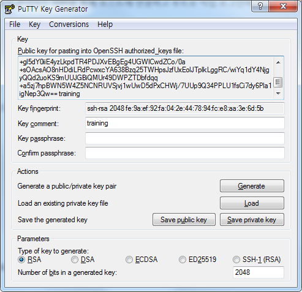

## CM Install Lab
### System Configuration Checks
Using the steps below, verify that all instances are ready. You must modify them when necessary, which includes installing missing packages and changing kernel tunables or other system settings.

You only need to show this work for one of the instances, but you will run into trouble later on if you don't complete this work on all of them.

  0. Prerequisite on all nodes
  - Run **_yum update_** and install **wget**
```
$ sudo yum update
$ sudo yum install -y wget
```


  - Create a user '**training**' with the gid '**wheel**' and set the password
```Bash
$ sudo useradd training -g wheel
$ sudo passwd training
```


  - Set **NOPASSWD** option for the group '**wheel**'
```Bash
$ sudo visudo
$ sudo cat /etc/sudoers | grep wheel
## Allows people in group wheel to run all commands
#%wheel ALL=(ALL)       ALL
%wheel  ALL=(ALL)       NOPASSWD: ALL
```


  - Generate RSA private/public key for the user 'training'


  - Append the public key to '~training/.ssh/authorized_keys'
```Bash
$ su - training
Password:
$ mkdir .ssh
$ vi .ssh/authorized_keys
$ chmod 600 .ssh/authorized_keys
$ cat .ssh/authorized_keys
```


  - Append the private key to '~training/.ssh/id_rsa'
```Bash
$ vi .ssh/id_rsa
$ chmod 600 .ssh/id_rsa
$ cat .ssh/id_rsa
```


  1. Check vm.swappiness on all your nodes
  - Set the value to 1 if necessary
```Bash
$ cat /proc/sys/vm/swappiness
30
$ sudo sysctl -w vm.swappiness=1
vm.swappiness = 1
$ cat /proc/sys/vm/swappiness
1
```

```Bash
$ sudo vi /etc/sysctl.conf
$ cat /etc/sysctl.conf
(중략)
vm.swappiness = 1
```


  2. Show the mount attributes of your volume(s)
```Bash
$ cat /proc/mounts
```


  3. If you have ext-based volumes, list the reserve space setting
  - XFS volumes do not support reserve space **_=> No ext-based volumes found_**
```Bash
$ cat /etc/fstab
(중략)
UUID=f41e390f-835b-4223-a9bb-9b45984ddf8d /                       xfs     defaults        0 0
```


  4. Disable transparent hugepage support
  - Check [disable-transparent-hugepages](files/disable-transparent-hugepages)
  - Check [tuned.conf](files/tuned.conf)
```Bash
$ sudo vi /etc/init.d/disable-transparent-hugepages
$ sudo chmod 755 /etc/init.d/disable-transparent-hugepages
$ sudo chkconfig --add disable-transparent-hugepages
$ sudo mkdir /etc/tuned/no-thp
$ sudo vi /etc/tuned/no-thp/tuned.conf
$ sudo tuned-adm profile no-thp
```

```Bash
$ cat /sys/kernel/mm/transparent_hugepage/enabled
always madvise [never]
$ cat /sys/kernel/mm/transparent_hugepage/defrag
always madvise [never]
```


  5. List your network interface configuration
```Bash
$ ifconfig -a
```


  6. Show that forward and reverse host lookups are correctly resolved
  - For /etc/hosts, use getent
  - For DNS, use nslookup
```Bash
$ sudo vi /etc/hosts
$ cat /etc/hosts
127.0.0.1   localhost localhost.localdomain localhost4 localhost4.localdomain4
# AWS servers
172.31.2.32     cm1
172.31.3.52     m1
172.31.12.190   w1
172.31.7.57     w2
172.31.1.53     w3
```

```Bash
$ sudo hostnamectl set-hostname m1
$ sudo sysctl -w net.ipv6.conf.all.disable_ipv6=1
$ sudo sysctl -w net.ipv6.conf.default.disable_ipv6=1
```

```Bash
$ sudo vi /etc/sysctl.conf
$ cat /etc/sysctl.conf | grep net.ipv6
net.ipv6.conf.all.disable_ipv6 = 1
net.ipv6.conf.default.disable_ipv6 = 1
```

```Bash
$ getent hosts cm1
172.31.2.32     cm1
$ getent hosts 172.31.2.32
172.31.2.32     cm1
```


  7. Show the nscd service is running
```Bash
$ sudo systemctl status nscd
Unit nscd.service could not be found.
$ sudo yum install nscd
$ sudo systemctl start nscd
$ sudo systemctl status nscd
$ sudo systemctl enable nscd
```


  8. Show the ntpd service is running
```Bash
$ sudo systemctl status ntp
Unit ntp.service could not be found.
$ sudo yum install ntp
$ sudo systemctl start ntpd
$ sudo systemctl status ntpd
$ sudo systemctl disable chronyd
Removed symlink /etc/systemd/system/multi-user.target.wants/chronyd.service.
$ sudo systemctl enable ntpd
$ ntpq -p
```


