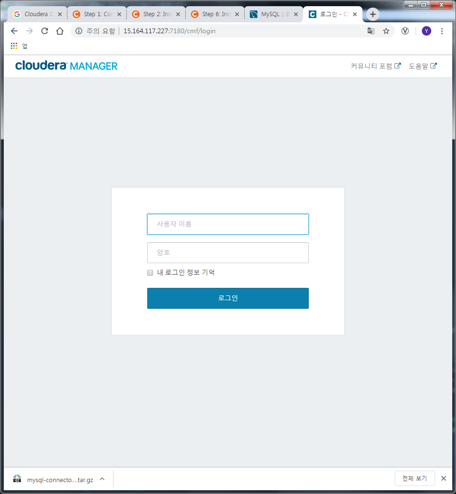

### Cloudera Manager Install Lab
#### Path B install using CM 5.15.x
[The full rundown](https://www.cloudera.com/documentation/enterprise/5-15-x/topics/install_cm_cdh.html) is here. You will have to modify your package repo to get the right release. The default repo download always points to the latest version.

Use the documentation to complete the following objectives:

  - **Install a supported Oracle JDK on your first node**
```Bash
$ sudo yum install -y oracle-j2sdk1.7
```
  - **Install a supported JDBC connector on all nodes**
  1. Install from the node _**cm1**_
```Bash
$ sudo wget https://dev.mysql.com/get/Downloads/Connector-J/mysql-connector-java-5.1.46.tar.gz ~/
$ tar xvfz ~/mysql-connector-java-5.1.46.tar.gz
$ sudo mkdir -p /usr/share/java
$ sudo cp ~/mysql-connector-java-5.1.46/mysql-connector-java-5.1.46-bin.jar /usr/share/java/mysql-connector-java.jar
```
  2. Copy to all other nodes
```Bash
$ scp /usr/share/java/mysql-connector-java.jar m1:~/
$ scp /usr/share/java/mysql-connector-java.jar w1:~/
$ scp /usr/share/java/mysql-connector-java.jar w2:~/
$ scp /usr/share/java/mysql-connector-java.jar w3:~/
$ ssh m1 "sudo mkdir -p /usr/share/java; sudo mv ~/mysql-connector-java.jar /usr/share/java/"
$ ssh w1 "sudo mkdir -p /usr/share/java; sudo mv ~/mysql-connector-java.jar /usr/share/java/"
$ ssh w2 "sudo mkdir -p /usr/share/java; sudo mv ~/mysql-connector-java.jar /usr/share/java/"
$ ssh w3 "sudo mkdir -p /usr/share/java; sudo mv ~/mysql-connector-java.jar /usr/share/java/"
```
  - **Create the databases and access grants you will need**
  1. Install **MariaDB**
```
$ sudo yum install mariadb-server
```
  2. Enable and run MariaDB
```
$ sudo systemctl enable mariadb
Created symlink from /etc/systemd/system/multi-user.target.wants/mariadb.service to /usr/lib/systemd/system/mariadb.service.
$ sudo systemctl start mariadb
```
  3. Run **/usr/bin/mysql_secure_installation** for security
```
$ sudo /usr/bin/mysql_secure_installation
```
  4. Create Databases and users for Cloudera manager and eco systems
```Bash
$ mysql -u root -p
CREATE DATABASE scm DEFAULT CHARACTER SET utf8 DEFAULT COLLATE utf8_general_ci; GRANT ALL ON scm.* TO 'scm'@'%' IDENTIFIED BY 'training';
CREATE DATABASE amon DEFAULT CHARACTER SET utf8 DEFAULT COLLATE utf8_general_ci; GRANT ALL ON amon.* TO 'amon'@'%' IDENTIFIED BY 'training';
CREATE DATABASE rmon DEFAULT CHARACTER SET utf8 DEFAULT COLLATE utf8_general_ci; GRANT ALL ON rmon.* TO 'rmon'@'%' IDENTIFIED BY 'training';
CREATE DATABASE hue DEFAULT CHARACTER SET utf8 DEFAULT COLLATE utf8_general_ci; GRANT ALL ON hue.* TO 'hue'@'%' IDENTIFIED BY 'training';
CREATE DATABASE metastore DEFAULT CHARACTER SET utf8 DEFAULT COLLATE utf8_general_ci; GRANT ALL ON metastore.* TO 'metastore'@'%' IDENTIFIED BY 'training';
CREATE DATABASE sentry DEFAULT CHARACTER SET utf8 DEFAULT COLLATE utf8_general_ci; GRANT ALL ON sentry.* TO 'sentry'@'%' IDENTIFIED BY 'training';
CREATE DATABASE oozie DEFAULT CHARACTER SET utf8 DEFAULT COLLATE utf8_general_ci; GRANT ALL ON oozie.* TO 'oozie'@'%' IDENTIFIED BY 'training';
FLUSH PRIVILEGES;
EXIT;
```
  - **Configure Cloudera Manager to connect to the database**
  1. Import Cloudera manager repository on **_cm1_** and install **cloudera-manager-daemons** **cloudera-manager-server**
```
$ sudo wget https://archive.cloudera.com/cm5/redhat/7/x86_64/cm/cloudera-manager.repo -P /etc/yum.repos.d/
$ sudo sed -i 's/x86_64\/cm\/5/x86_64\/cm\/5.15.2/g' /etc/yum.repos.d/cloudera-manager.repo
$ sudo rpm --import https://archive.cloudera.com/cm5/redhat/7/x86_64/cm/RPM-GPG-KEY-cloudera
$ sudo yum install -y cloudera-manager-daemons cloudera-manager-server
```
  2. Run initialize script for SCM
```Bash
$ sudo /usr/share/cmf/schema/scm_prepare_database.sh mysql scm scm training
JAVA_HOME=/usr/java/jdk1.7.0_67-cloudera
Verifying that we can write to /etc/cloudera-scm-server
Creating SCM configuration file in /etc/cloudera-scm-server
Executing:  /usr/java/jdk1.7.0_67-cloudera/bin/java -cp /usr/share/java/mysql-connector-java.jar:/usr/share/java/oracle-connector-java.jar:/usr/share/java/postgresql-connector-java.jar:/usr/share/cmf/schema/../lib/* com.cloudera.enterprise.dbutil.DbCommandExecutor /etc/cloudera-scm-server/db.properties com.cloudera.cmf.db.
[                          main] DbCommandExecutor              INFO  Successfully connected to database.
All done, your SCM database is configured correctly!
```
  - **Start your Cloudera Manager server -- debug as necessary**
```Bash
$ sudo systemctl start cloudera-scm-server
$ sudo tail -f /var/log/cloudera-scm-server/cloudera-scm-server.log
```
  - **Do not continue until you can browse your CM instance at port 7180**

