### MySQL/MariaDB Installation La
#### Configure MySQL with a replica server
Choose one of these plans to follow:
  - You can use the steps documented here for MariaDB or here for MySQL.
  - The steps below are MySQL-specific.
    - If you are using RHEL/CentOS 7.x, use MariaDB.

### MySQL installation - Plan Two Detail
#### 1. Download and implement the official MySQL repo
  - Enable the repo to install MySQL 5.5
  - Install the mysql package on all nodes
  - Install mysql-server on the server and replica nodes
  - Do this on a replica server only as MariadDB has already installed in the master server at the _[Install Cloudera Manager](02_InstallClouderaManager.md) Step_

1. Install MariaDB
```
$ sudo yum install -y mariadb-server
```
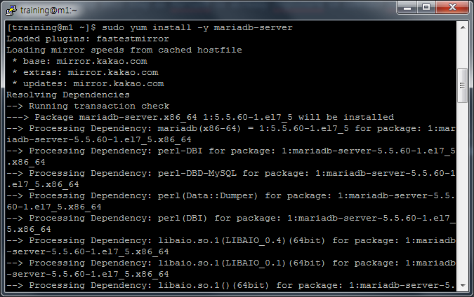

2. Enable and run MariaDB
```
$ sudo systemctl start mariadb
$ sudo systemctl enable mariadb
Created symlink from /etc/systemd/system/multi-user.target.wants/mariadb.service to /usr/lib/systemd/system/mariadb.service.
```
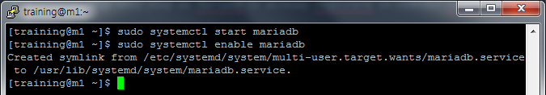

3. Run **/usr/bin/mysql_secure_installation** for security
```
$ sudo /usr/bin/mysql_secure_installation

NOTE: RUNNING ALL PARTS OF THIS SCRIPT IS RECOMMENDED FOR ALL MariaDB
      SERVERS IN PRODUCTION USE!  PLEASE READ EACH STEP CAREFULLY!

In order to log into MariaDB to secure it, we'll need the current
password for the root user.  If you've just installed MariaDB, and
you haven't set the root password yet, the password will be blank,
so you should just press enter here.

Enter current password for root (enter for none):
OK, successfully used password, moving on...

Setting the root password ensures that nobody can log into the MariaDB
root user without the proper authorisation.

Set root password? [Y/n] Y
New password:
Re-enter new password:
Password updated successfully!
Reloading privilege tables..
 ... Success!


By default, a MariaDB installation has an anonymous user, allowing anyone
to log into MariaDB without having to have a user account created for
them.  This is intended only for testing, and to make the installation
go a bit smoother.  You should remove them before moving into a
production environment.

Remove anonymous users? [Y/n] Y
 ... Success!

Normally, root should only be allowed to connect from 'localhost'.  This
ensures that someone cannot guess at the root password from the network.

Disallow root login remotely? [Y/n] N
 ... skipping.

By default, MariaDB comes with a database named 'test' that anyone can
access.  This is also intended only for testing, and should be removed
before moving into a production environment.

Remove test database and access to it? [Y/n] Y
 - Dropping test database...
 ... Success!
 - Removing privileges on test database...
 ... Success!

Reloading the privilege tables will ensure that all changes made so far
will take effect immediately.

Reload privilege tables now? [Y/n] Y
 ... Success!

Cleaning up...

All done!  If you've completed all of the above steps, your MariaDB
installation should now be secure.

Thanks for using MariaDB!
```
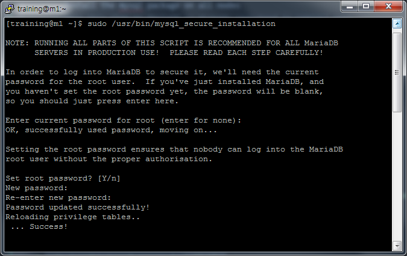

  - Download and copy the JDBC connector to all nodes.
    - _Check **Install a supported JDBC connector on all nodes** in [Install Cloudera Manager](02_InstallClouderaManager.md) Step_

#### 2. You should not need to build a /etc/my.cnf file to start your MySQL server
  - You will have to modify it to support replication. Check MySQL documentation.

1. **[ Master Server (cm1) ]** Edit /etc/my.cnf file and restart service
```
$ sudo vi /etc/my.cnf

# Replication Setting - Master
server_id=1
log_bin=/var/lib/mysql/mysql_binary_log
log_bin_index=/var/lib/mysql/mysql_binary_log.index
binlog-format=row
binlog-do-db=scm
binlog-do-db=amon
binlog-do-db=rmon
binlog-do-db=hue
binlog-do-db=metastore
binlog-do-db=oozie

$ sudo systemctl restart mariadb
```  
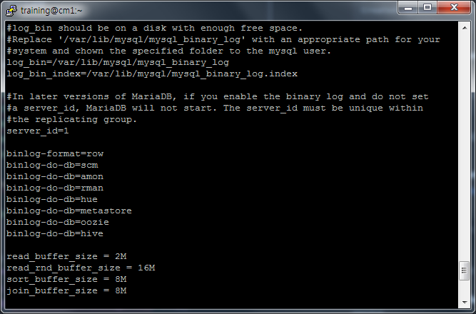

2. **[ Master Server (cm1) ]** Create a new user **_replication_user_** for replication
```
$ mysql -u root -p
GRANT REPLICATION SLAVE, REPLICATION CLIENT ON *.* TO 'replication_user'@'%' IDENTIFIED BY 'training';
FLUSH PRIVILEGES;
```
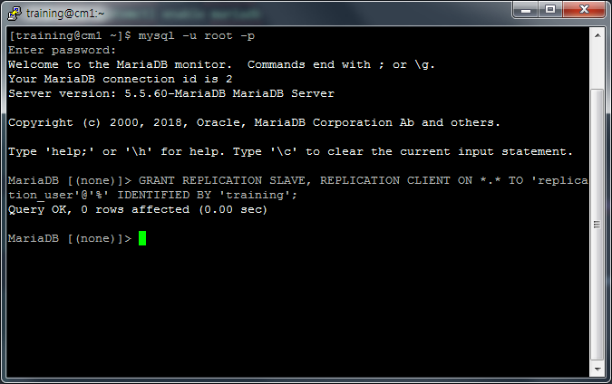

3. **[ Master Server (cm1) ]** Lock tables
```
FLUSH TABLES WITH READ LOCK;
SHOW MASTER STATUS;
```
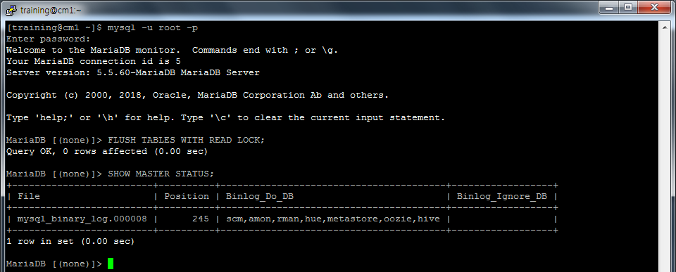

4. **[ Master Server (cm1) ]** Backup Master server database and copy to slave server
```
$ sudo mysqldump --all-databases --user=root --password --master-data > masterdatabase.sql
Enter password:
$ scp masterdatabase.sql training@m1:~/
```
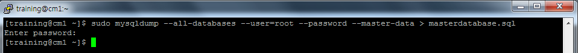


5. **[ Slave Server (m1) ]** Edit /etc/my.cnf file and restart service
```
$ sudo vi /etc/my.cnf

server_id=2
log_bin=/var/lib/mysql/mysql_binary_log
log_bin_index=/var/lib/mysql/mysql_binary_log.index
binlog-do-db=scm
binlog-do-db=amon
binlog-do-db=rmon
binlog-do-db=hue
binlog-do-db=metastore
binlog-do-db=oozie

$ sudo systemctl restart mariadb
```


6. **[ Slave Server (m1) ]** Restore database using **_masterdatabase.sql_**
```
$ mysql -u root -p < masterdatabase.sql
```
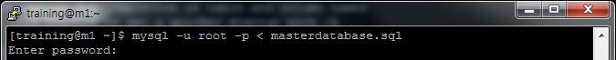

7. **[ Slave Server (m1) ]**  Configure Slave
```
stop slave;
change master to master_host='cm1', master_user='replication_user',master_password='training',master_log_file='mysql_binary_log.000008', master_log_pos=245;
slave start;
```


8.  **[ Slave Server (m1) ]** Show slave status
```
SHOW SLAVE STATUS\G;
```
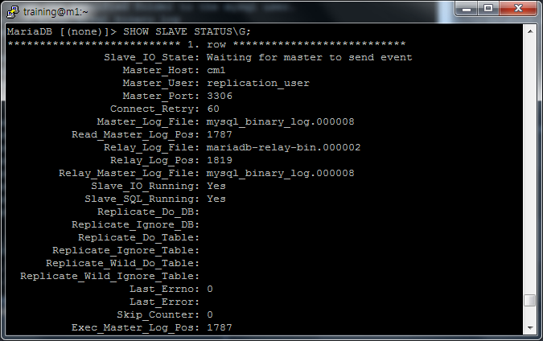

9. **[ Master Server(cm1) ]** Unlock tables
```
unlock tables;
```
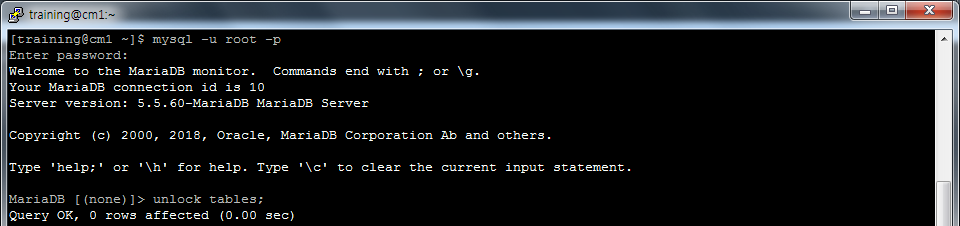

10. **[ Master Server(cm1) ]** Create a table and insert rows for replication test
```
USE scm;
CREATE TABLE TMP_TBL (COL INT);
INSERT INTO TMP_TBL VALUES (1);
SELECT * FROM TMP_TBL;
COMMIT;
```
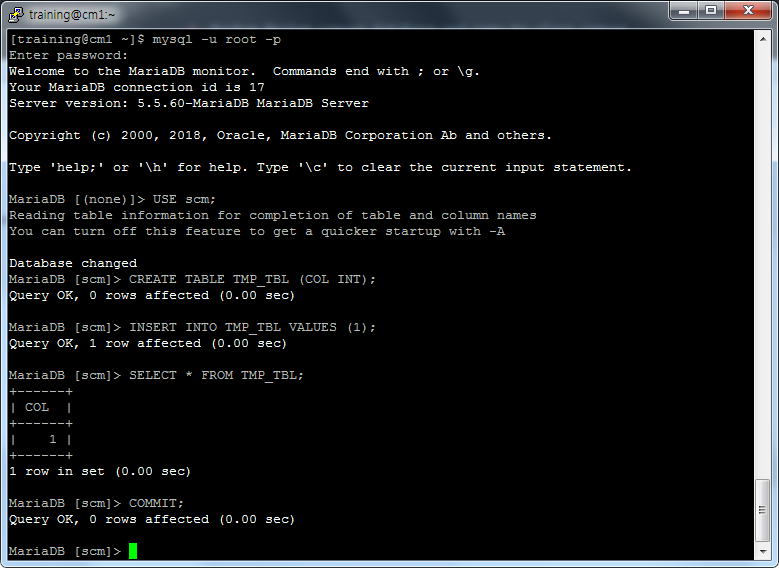

11. **[ Slave Server(m1) ]** Select table just created
```
USE scm;
SELECT * FROM TMP_TBL;
```
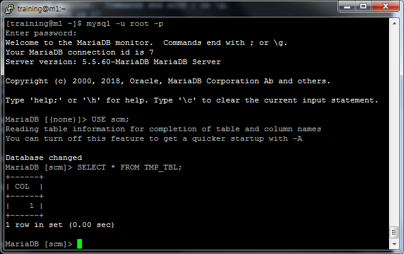
