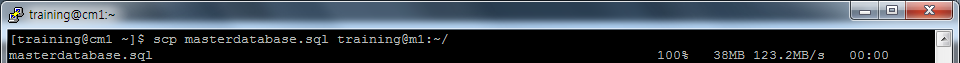
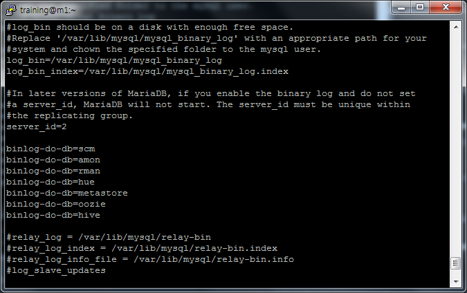
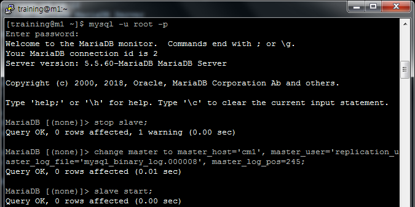

### MySQL/MariaDB Installation La
#### Configure MySQL with a replica server
Choose one of these plans to follow:
  - You can use the steps documented here for MariaDB or here for MySQL.
  - The steps below are MySQL-specific.
    - If you are using RHEL/CentOS 7.x, use MariaDB.

### MySQL installation - Plan Two Detail
  1. Download and implement the official MySQL repo
    - Enable the repo to install MySQL 5.5
      - Skip this step as MariaDB is already registerd in CENTOS7 repo
    - Install the mysql package on all nodes
      - Skip this step as MariaDB is already registerd in CENTOS7 repo
    - Install mysql-server on the server and replica nodes
      - Do this on a replica server only as MariadDB has already installed in the master server at the _[Install Cloudera Manager](02_InstallClouderaManager.md) Step_
    1. Install MariaDB
```
$ sudo yum install -y mariadb-server
```


    2. Enable and run MariaDB
```
$ sudo systemctl start mariadb
$ sudo systemctl enable mariadb
Created symlink from /etc/systemd/system/multi-user.target.wants/mariadb.service to /usr/lib/systemd/system/mariadb.service.
```


    3. Run **/usr/bin/mysql_secure_installation** for security
```
$ sudo /usr/bin/mysql_secure_installation
```


    - Download and copy the JDBC connector to all nodes.
    > _Check **Install a supported JDBC connector on all nodes** in [Install Cloudera Manager](02_InstallClouderaManager.md) Step_

  2. You should not need to build a /etc/my.cnf file to start your MySQL server
    - You will have to modify it to support replication. Check MySQL documentation.
    1. **[ Master Server (cm1) ]** Edit /etc/my.cnf file and restart service
```
$ sudo vi /etc/my.cnf
$ sudo systemctl restart mariadb
```  


    2. **[ Master Server (cm1) ]** Create a new user **_replication_user_** for replication
```
$ mysql -u root -p
GRANT REPLICATION SLAVE, REPLICATION CLIENT ON *.* TO 'replication_user'@'%' IDENTIFIED BY 'training';
```


    3. **[ Master Server (cm1) ]** Lock tables
```
FLUSH TABLES WITH READ LOCK;
SHOW MASTER STATUS;
```


    4. **[ Master Server (cm1) ]** Backup Master server database and copy to slave server
```
$ sudo mysqldump --all-databases --user=root --password --master-data > masterdatabase.sql
Enter password:
$ scp masterdatabase.sql training@m1:~/
```



    5. **[ Slave Server (m1) ]** Edit /etc/my.cnf file and restart service
```
$ sudo vi /etc/my.cnf
$ sudo systemctl restart mariadb
```


    6. **[ Slave Server (m1) ]** Restore database using **_masterdatabase.sql_**
```
$ mysql -u root -p < masterdatabase.sql
```


    7. **[ Slave Server (m1) ]**  Configure Slave
```
stop slave;
change master to master_host='cm1', master_user='replication_uaster_log_file='mysql_binary_log.000008', master_log_pos=245;
slave start;
```


    8.  **[ Slave Server (m1) ]** Show slave status
```
SHOW SLAVE STATUS\G;
```


    9. **[ Master Server(cm1) ]** Unlock tables
```
unlock tables;
```


    10. **[ Master Server(cm1) ]** Create a table and insert rows for replication test
```
USE scm;
CREATE TABLE TMP_TBL (COL INT);
INSERT INTO TMP_TBL VALUES (1);
SELECT * FROM TMP_TBL;
COMMIT;
```


    11. **[ Slave Server(m1) ]** Select table just created
```
USE scm;
SELECT * FROM TMP_TBL;
```

