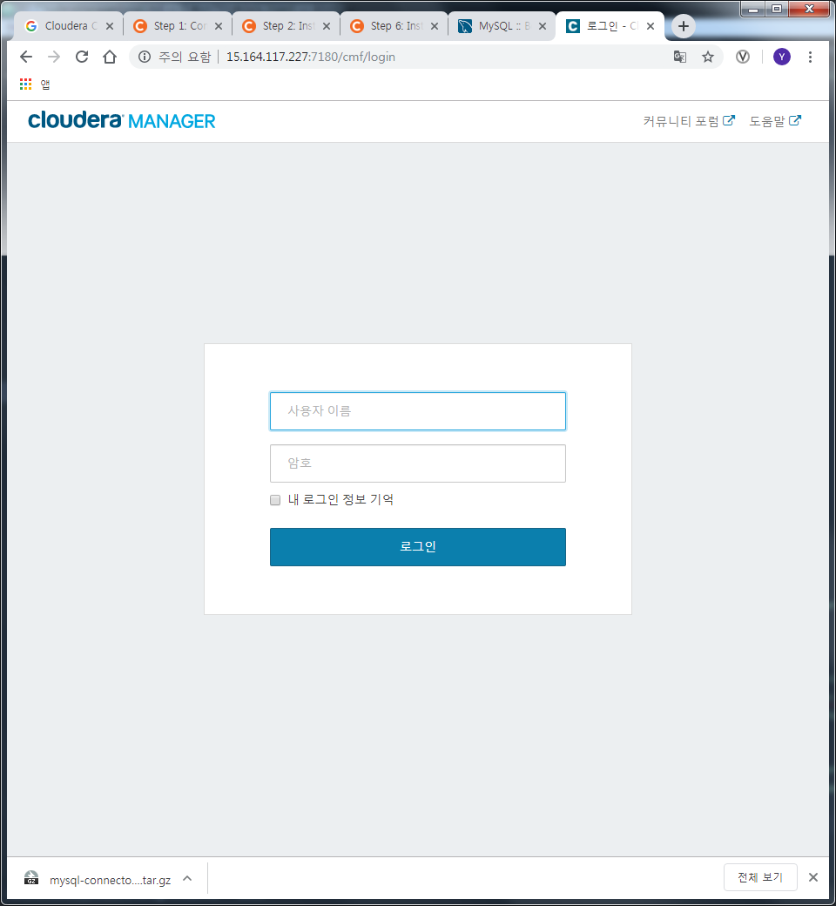
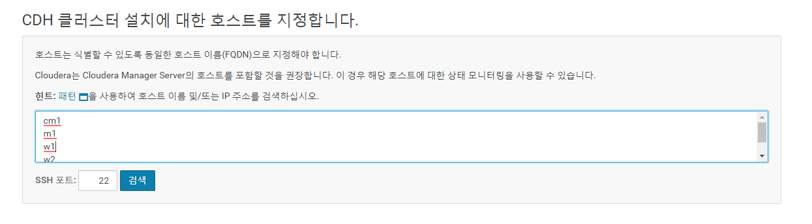
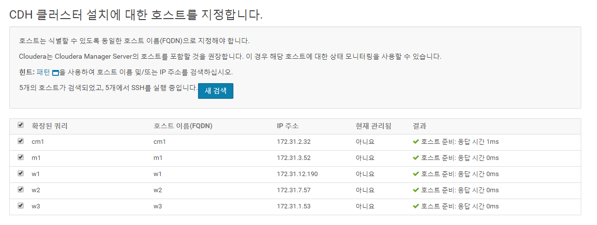
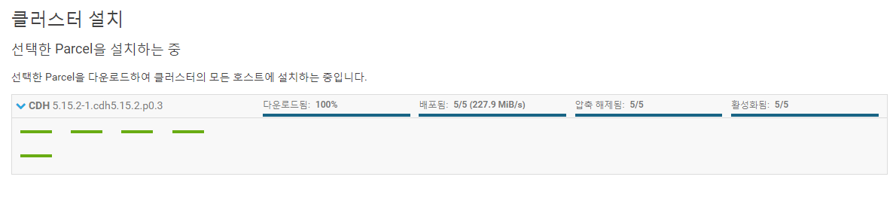
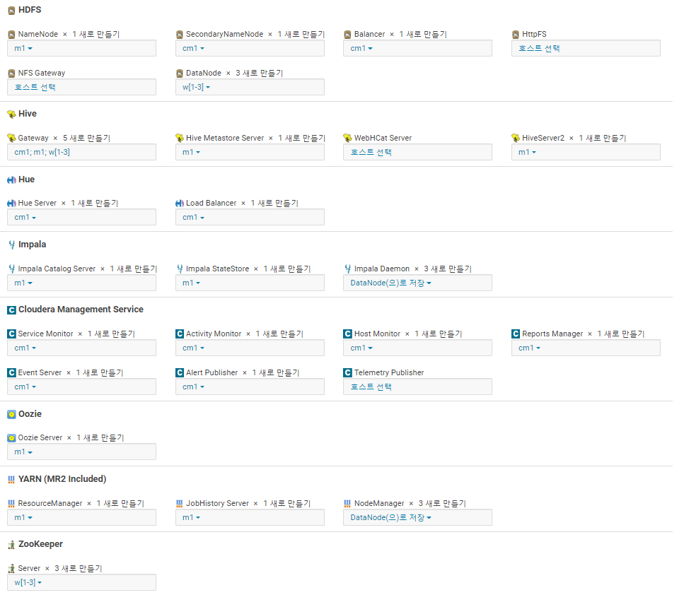
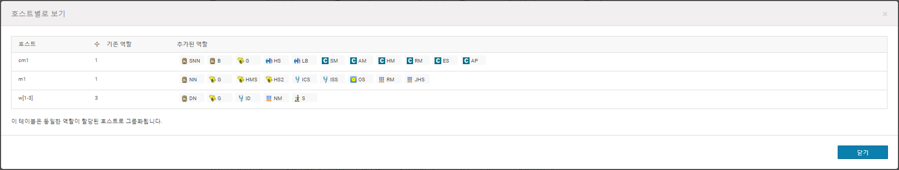
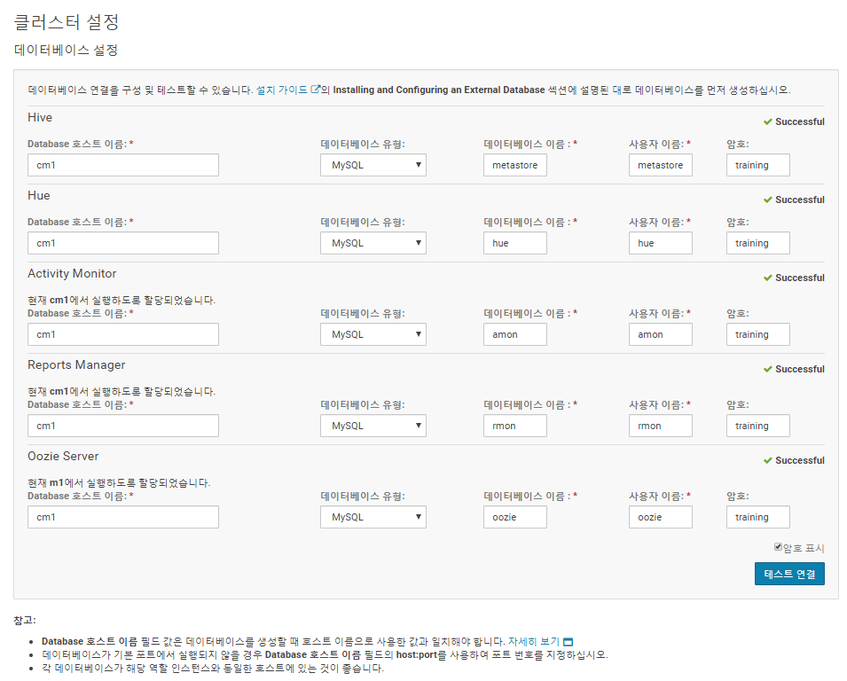
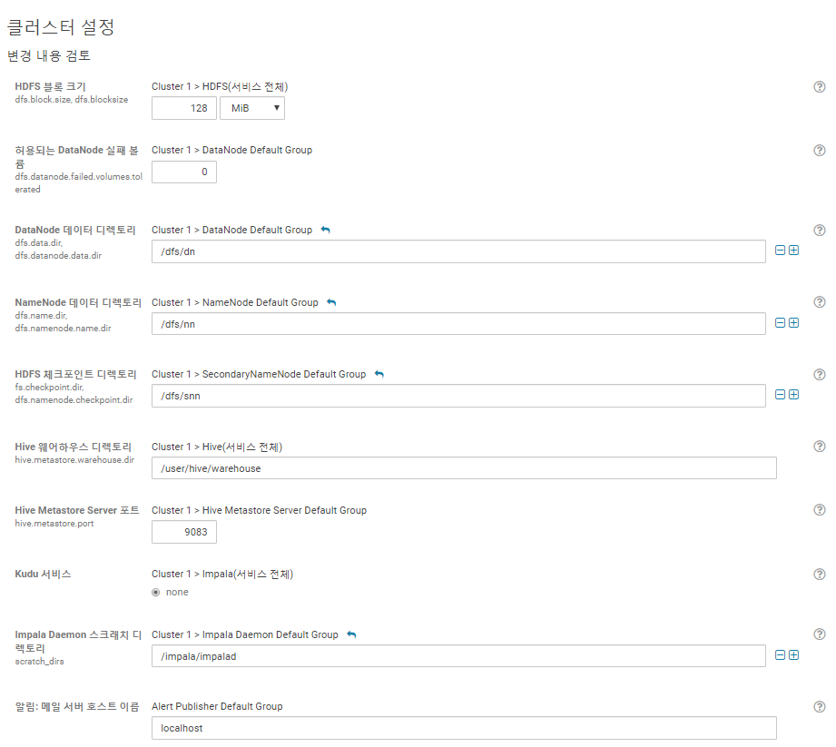
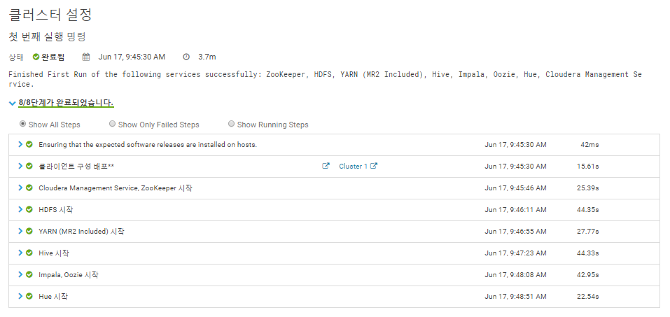
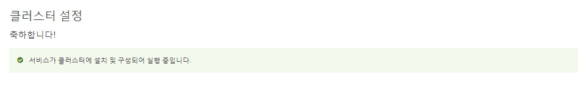

### Cloudera Manager Install Lab
#### Install a cluster and deploy CDH
Adhere to the following requirements while creating your cluster:
  - Do not use Single User Mode. Do not. Don't do it.
  - Ignore any steps in the CM wizard that are marked (Optional)
  - Install the Data Hub Edition
  - Install CDH using parcels
  - Deploy only the Core set of CDH services.
  - Deploy three ZooKeeper instances.
    - CM does not tell you to do this but complains if you don't

1. Open Cloudera Manager Console from a browser

2. Put target nodes' FQDN

3. Select nodes on the list

4. Put account information for agent installation
> TODO: take a screenshot

5. Check the installation steps on each nodes

6. Set roles on each nodes

7. Check roles on each nodes

8. Set Database information for each services

9. Check cluster setting

10. Check cluster setting steps on each services

11. Final message of cluster installation

