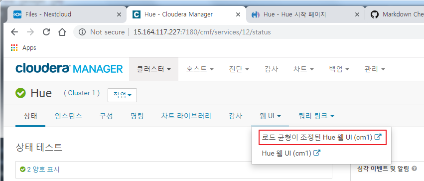
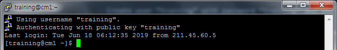
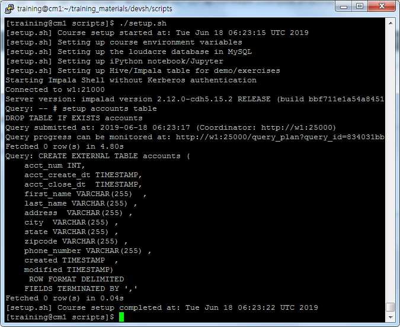

### Install Sqoop, Spark and Kafka
Installing Kafka requires some special attention. You will need to download,
distribute and activate the Kafka package before you can add the Kafka service.

- Create user “training” with password “training” and add to group wheel for sudo
access.
  - _Check **0. Prerequisite** in [System Setup](01_SystemSetup.md) Step_

- Log into Hue as user “training” with password “training”
  - This will create a HDFS directory for the user



- Now, try ssh’ing into the hosts as user “training”


- From the bit.ly folder, download all.zip and unzip it.
  - Do this in both your CM host and one of the datanode hosts.
  - Go to training_material/devsh/scripts and review the setup.sh
- See how it works. We are going to use it to create some data for ourselves but it won’t work right away. See if you can figure out what needs to be done to make it work.
- You will need to add user “training” with password “training” to your MySql installation and Grant the necessary rights

1. Add a new user 'training' in MariaDB
```
$ mysql -u root -p
CREATE USER 'training'@'localhost' IDENTIFIED BY 'training';
GRANT ALL PRIVILEGES ON *.* TO 'training'@'localhost';
FLUSH PRIVILEGES;
```

2. Add "**-i w1:21000**" option to the command 'impala-shell'
```
(중략)
impala-shell -i w1:21000 -f $COURSEDIR/scripts/create-accounts.sql
(중략)
```

3. Run _setup.sh_ script
```
$ ./setup.sh
```


- Now, attempt some of the exercises that we did during our previous lessons in our
new Hadoop cluster.
- You should practice the following as a minimum
  - Flume
  - Sqoop
  - Hive
  - Impala
  - Spark
