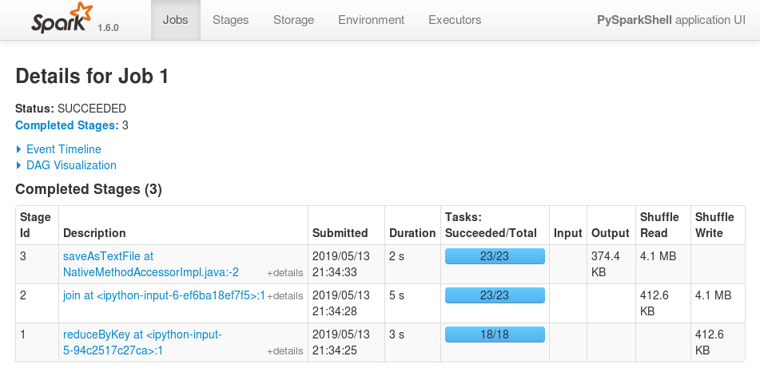
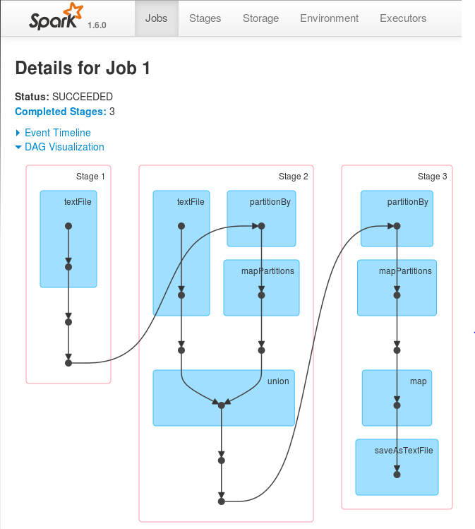
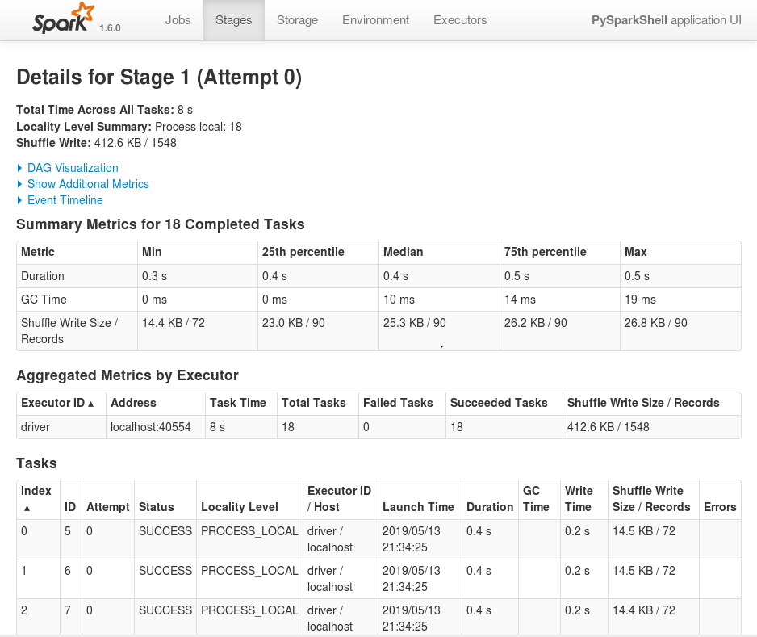
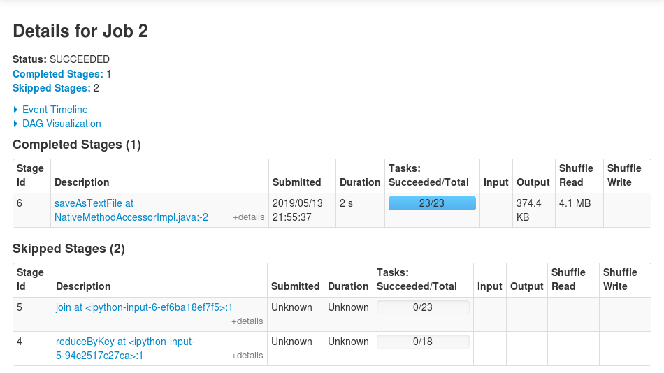

# Spark Exercise
Lab resource: http://bit.ly/2Z3HEBY


### Exercise 6
3. How many partitions are in the resulting RDD? (2)


4. Does the RDD correctly have three partitions? (Yes)


5. How does the number of files in the dataset compare to the number of partitions in the RDD? (5)


10. Print the results of accountHits.toDebugString and review the output. Based on this, see if you can determine
```
In [7]: print accountHits.toDebugString()
(23) PythonRDD[16] at RDD at PythonRDD.scala:43 []
 |   MapPartitionsRDD[15] at mapPartitions at PythonRDD.scala:374 []
 |   ShuffledRDD[14] at partitionBy at NativeMethodAccessorImpl.java:-2 []
 +-(23) PairwiseRDD[13] at join at <ipython-input-6-ef6ba18ef7f5>:1 []
    |   PythonRDD[12] at join at <ipython-input-6-ef6ba18ef7f5>:1 []
    |   UnionRDD[11] at union at NativeMethodAccessorImpl.java:-2 []
    |   PythonRDD[9] at RDD at PythonRDD.scala:43 []
    |   /loudacre/accounts/* MapPartitionsRDD[1] at textFile at NativeMethodAccessorImpl.java:-2 []
    |   /loudacre/accounts/* HadoopRDD[0] at textFile at NativeMethodAccessorImpl.java:-2 []
    |   PythonRDD[10] at RDD at PythonRDD.scala:43 []
    |   MapPartitionsRDD[8] at mapPartitions at PythonRDD.scala:374 []
    |   ShuffledRDD[7] at partitionBy at NativeMethodAccessorImpl.java:-2 []
    +-(18) PairwiseRDD[6] at reduceByKey at <ipython-input-5-94c2517c27ca>:1 []
       |   PythonRDD[5] at reduceByKey at <ipython-input-5-94c2517c27ca>:1 []
       |   /loudacre/weblogs/*2.log MapPartitionsRDD[4] at textFile at NativeMethodAccessorImpl.java:-2 []
       |   /loudacre/weblogs/*2.log HadoopRDD[3] at textFile at NativeMethodAccessorImpl.java:-2 []
```

  a. How many stages are in this job? (3)

  b. Which stages are dependent on which? (The stage 'join' is dependent on the stage 'reduceByKey')

  c. How many tasks will each stage consist of?
    - reduceByKey: 18
    - join: 23
    - ???: 23


15. Click the job description (which is the last action in the job) to see the stages. As the job progresses you may want to refresh the page a few times. Things to note:



  a. How many stages are in the job? (3) Does it match the number you expected from the RDDs toDebugString output? (Yes)

  b. The stages are numbered, but the numbers do not relate to the order of execution. Note the times the stages were submitted to determine the order. Does the order match what you expected based on RDD dependency? (Yes)

  c. How many tasks are in each stage?
    - reduceByKey: 18
    - join: 23
    - saveAsTextFile: 23

  d. The Shuffle Read and Shuffle Write columns indicate how much data was copied between tasks. This is useful to know because copying too much data across the network can cause performance issues.


16. Click the stages to view details about that stage. Things to note:


  a. The Summary Metrics area shows you how much time was spend on various steps. This can help you narrow down performance problems.

  b. The Tasks area lists each task. The Locality Level column indicates whether the process ran on the same node where the partition was physically stored or not. Remember that Spark will attempt to always run tasks where the data is, but may not always be able to, if the node is busy.

  c. In a real-world cluster, the executor column in the Task area would display the different worker nodes that ran the tasks. (In this single- node cluster, all tasks run on the same host: localhost.)


18. Optional: Try re-running the last action. (You will need to either delete the saveAsTextFile output directory in HDFS, or specify a different directory name.) You will probably find that the job completes much faster, and that several stages (and the tasks in them) show as “skipped.”

  Bonus question: Which tasks were skipped and why?
  - reduceByKey and join
  - 수행한 결과가 메모리에 존재하고 있기 때문에???

  
