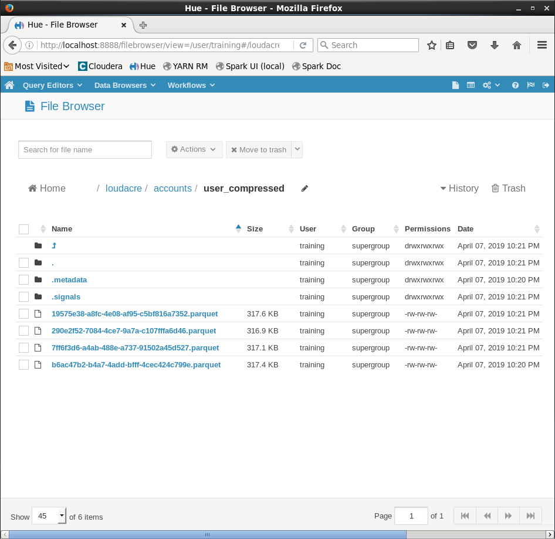
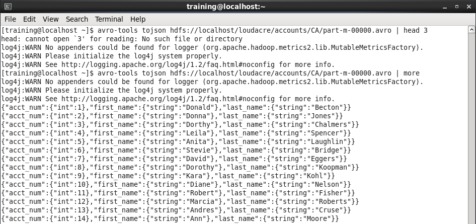

# Sqoop Exercise

1. From the accounts table, import only the primary key, along with the first name, last name to HDFS directory /loudacre/accounts/user_info. Please save the file in text format with tab delimiters.

  **Hint**: You will have to figure out what the name of the table columns are in order to complete this exercise.

  A. Look up table `accounts` and find out primary key, first name and last name columns.
  ```
  [training@localhost ~]$ sqoop eval --connect jdbc:mysql://localhost/loudacre --username training --password training --query "DESCRIBE accounts"
  19/04/07 22:11:19 INFO sqoop.Sqoop: Running Sqoop version: 1.4.6-cdh5.7.0
  19/04/07 22:11:19 WARN tool.BaseSqoopTool: Setting your password on the command-line is insecure. Consider using -P instead.
  19/04/07 22:11:19 INFO manager.MySQLManager: Preparing to use a MySQL streaming resultset.
  ---------------------------------------------------------------------------------------------------------
  | Field                | Type                 | Null | Key | Default              | Extra                |
  ---------------------------------------------------------------------------------------------------------
  | acct_num             | int(11)              | NO  | PRI | (null)               |                      |
  | acct_create_dt       | datetime             | NO  |     | (null)               |                      |
  | acct_close_dt        | datetime             | YES |     | (null)               |                      |
  | first_name           | varchar(255)         | NO  |     | (null)               |                      |
  | last_name            | varchar(255)         | NO  |     | (null)               |                      |
  | address              | varchar(255)         | NO  |     | (null)               |                      |
  | city                 | varchar(255)         | NO  |     | (null)               |                      |
  | state                | varchar(255)         | NO  |     | (null)               |                      |
  | zipcode              | varchar(255)         | NO  |     | (null)               |                      |
  | phone_number         | varchar(255)         | NO  |     | (null)               |                      |
  | created              | datetime             | NO  |     | (null)               |                      |
  | modified             | datetime             | NO  |     | (null)               |                      |
  ---------------------------------------------------------------------------------------------------------
  ```
  * Primary Key: acct_num
  * First Name: first_name
  * Last Name: last_name

  B. Import the table `accounts`
  ```
  [training@localhost ~]$ sqoop import \
> --table accounts \
> --connect jdbc:mysql://localhost/loudacre \
> --username training --password training \
> --columns "acct_num,first_name,last_name" \
> --target-dir /loudacre/accounts/user_info \
> --fields-terminated-by "\t" \
> --as-textfile
19/04/07 22:15:49 INFO sqoop.Sqoop: Running Sqoop version: 1.4.6-cdh5.7.0
19/04/07 22:15:49 WARN tool.BaseSqoopTool: Setting your password on the command-line is insecure. Consider using -P instead.
19/04/07 22:15:50 INFO manager.MySQLManager: Preparing to use a MySQL streaming resultset.
19/04/07 22:15:50 INFO tool.CodeGenTool: Beginning code generation
19/04/07 22:15:50 INFO manager.SqlManager: Executing SQL statement: SELECT t.* FROM `accounts` AS t LIMIT 1
19/04/07 22:15:50 INFO manager.SqlManager: Executing SQL statement: SELECT t.* FROM `accounts` AS t LIMIT 1
19/04/07 22:15:50 INFO orm.CompilationManager: HADOOP_MAPRED_HOME is /usr/lib/hadoop-mapreduce
Note: /tmp/sqoop-training/compile/865ae3ba639bb6d4e8c1ed465b10881d/accounts.java uses or overrides a deprecated API.
Note: Recompile with -Xlint:deprecation for details.
19/04/07 22:15:52 INFO orm.CompilationManager: Writing jar file: /tmp/sqoop-training/compile/865ae3ba639bb6d4e8c1ed465b10881d/accounts.jar
19/04/07 22:15:52 WARN manager.MySQLManager: It looks like you are importing from mysql.
19/04/07 22:15:52 WARN manager.MySQLManager: This transfer can be faster! Use the --direct
19/04/07 22:15:52 WARN manager.MySQLManager: option to exercise a MySQL-specific fast path.
19/04/07 22:15:52 INFO manager.MySQLManager: Setting zero DATETIME behavior to convertToNull (mysql)
19/04/07 22:15:52 INFO mapreduce.ImportJobBase: Beginning import of accounts
19/04/07 22:15:52 INFO Configuration.deprecation: mapred.job.tracker is deprecated. Instead, use mapreduce.jobtracker.address
19/04/07 22:15:52 INFO Configuration.deprecation: mapred.jar is deprecated. Instead, use mapreduce.job.jar
19/04/07 22:15:53 INFO Configuration.deprecation: mapred.map.tasks is deprecated. Instead, use mapreduce.job.maps
19/04/07 22:15:53 INFO client.RMProxy: Connecting to ResourceManager at /0.0.0.0:8032
19/04/07 22:15:55 INFO db.DBInputFormat: Using read commited transaction isolation
19/04/07 22:15:55 INFO db.DataDrivenDBInputFormat: BoundingValsQuery: SELECT MIN(`acct_num`), MAX(`acct_num`) FROM `accounts`
19/04/07 22:15:55 INFO db.IntegerSplitter: Split size: 32440; Num splits: 4 from: 1 to: 129761
19/04/07 22:15:55 INFO mapreduce.JobSubmitter: number of splits:4
19/04/07 22:15:55 INFO mapreduce.JobSubmitter: Submitting tokens for job: job_1554697449343_0004
19/04/07 22:15:56 INFO impl.YarnClientImpl: Submitted application application_1554697449343_0004
19/04/07 22:15:56 INFO mapreduce.Job: The url to track the job: http://localhost:8088/proxy/application_1554697449343_0004/
19/04/07 22:15:56 INFO mapreduce.Job: Running job: job_1554697449343_0004
19/04/07 22:16:03 INFO mapreduce.Job: Job job_1554697449343_0004 running in uber mode : false
19/04/07 22:16:03 INFO mapreduce.Job:  map 0% reduce 0%
19/04/07 22:16:10 INFO mapreduce.Job:  map 25% reduce 0%
19/04/07 22:16:15 INFO mapreduce.Job:  map 50% reduce 0%
19/04/07 22:16:20 INFO mapreduce.Job:  map 75% reduce 0%
19/04/07 22:16:25 INFO mapreduce.Job:  map 100% reduce 0%
19/04/07 22:16:25 INFO mapreduce.Job: Job job_1554697449343_0004 completed successfully
19/04/07 22:16:26 INFO mapreduce.Job: Counters: 30
	File System Counters
		FILE: Number of bytes read=0
		FILE: Number of bytes written=560464
		FILE: Number of read operations=0
		FILE: Number of large read operations=0
		FILE: Number of write operations=0
		HDFS: Number of bytes read=470
		HDFS: Number of bytes written=2615920
		HDFS: Number of read operations=16
		HDFS: Number of large read operations=0
		HDFS: Number of write operations=8
	Job Counters
		Launched map tasks=4
		Other local map tasks=4
		Total time spent by all maps in occupied slots (ms)=0
		Total time spent by all reduces in occupied slots (ms)=0
		Total time spent by all map tasks (ms)=15607
		Total vcore-seconds taken by all map tasks=15607
		Total megabyte-seconds taken by all map tasks=3995392
	Map-Reduce Framework
		Map input records=129761
		Map output records=129761
		Input split bytes=470
		Spilled Records=0
		Failed Shuffles=0
		Merged Map outputs=0
		GC time elapsed (ms)=219
		CPU time spent (ms)=3590
		Physical memory (bytes) snapshot=501219328
		Virtual memory (bytes) snapshot=8262221824
		Total committed heap usage (bytes)=251920384
	File Input Format Counters
		Bytes Read=0
	File Output Format Counters
		Bytes Written=2615920
19/04/07 22:16:26 INFO mapreduce.ImportJobBase: Transferred 2.4947 MB in 32.4027 seconds (78.8393 KB/sec)
19/04/07 22:16:26 INFO mapreduce.ImportJobBase: Retrieved 129761 records.

  ```

2. This time save the same in parquet format with snappy compression. Save it in /loudacre/accounts/user_compressed. Provide.a screenshot of HUE with the new directory created.
  ```
  [training@localhost ~]$ sqoop import \
> --table accounts \
> --connect jdbc:mysql://localhost/loudacre \
> --username training --password training \
> --columns "acct_num,first_name,last_name" \
> --target-dir /loudacre/accounts/user_compressed \
> --compression-codec org.apache.hadoop.io.compress.SnappyCodec \
> --as-parquetfile
19/04/07 22:20:32 INFO sqoop.Sqoop: Running Sqoop version: 1.4.6-cdh5.7.0
19/04/07 22:20:32 WARN tool.BaseSqoopTool: Setting your password on the command-line is insecure. Consider using -P instead.
19/04/07 22:20:33 INFO manager.MySQLManager: Preparing to use a MySQL streaming resultset.
19/04/07 22:20:33 INFO tool.CodeGenTool: Beginning code generation
19/04/07 22:20:33 INFO tool.CodeGenTool: Will generate java class as codegen_accounts
19/04/07 22:20:33 INFO manager.SqlManager: Executing SQL statement: SELECT t.* FROM `accounts` AS t LIMIT 1
19/04/07 22:20:33 INFO manager.SqlManager: Executing SQL statement: SELECT t.* FROM `accounts` AS t LIMIT 1
19/04/07 22:20:33 INFO orm.CompilationManager: HADOOP_MAPRED_HOME is /usr/lib/hadoop-mapreduce
Note: /tmp/sqoop-training/compile/21d273dadc794ecdc80f7edc06d6a915/codegen_accounts.java uses or overrides a deprecated API.
Note: Recompile with -Xlint:deprecation for details.
19/04/07 22:20:35 INFO orm.CompilationManager: Writing jar file: /tmp/sqoop-training/compile/21d273dadc794ecdc80f7edc06d6a915/codegen_accounts.jar
19/04/07 22:20:35 WARN manager.MySQLManager: It looks like you are importing from mysql.
19/04/07 22:20:35 WARN manager.MySQLManager: This transfer can be faster! Use the --direct
19/04/07 22:20:35 WARN manager.MySQLManager: option to exercise a MySQL-specific fast path.
19/04/07 22:20:35 INFO manager.MySQLManager: Setting zero DATETIME behavior to convertToNull (mysql)
19/04/07 22:20:35 INFO mapreduce.ImportJobBase: Beginning import of accounts
19/04/07 22:20:35 INFO Configuration.deprecation: mapred.job.tracker is deprecated. Instead, use mapreduce.jobtracker.address
19/04/07 22:20:35 INFO Configuration.deprecation: mapred.jar is deprecated. Instead, use mapreduce.job.jar
19/04/07 22:20:36 INFO manager.SqlManager: Executing SQL statement: SELECT t.* FROM `accounts` AS t LIMIT 1
19/04/07 22:20:36 INFO manager.SqlManager: Executing SQL statement: SELECT t.* FROM `accounts` AS t LIMIT 1
19/04/07 22:20:38 INFO Configuration.deprecation: mapred.map.tasks is deprecated. Instead, use mapreduce.job.maps
19/04/07 22:20:38 INFO client.RMProxy: Connecting to ResourceManager at /0.0.0.0:8032
19/04/07 22:20:40 INFO db.DBInputFormat: Using read commited transaction isolation
19/04/07 22:20:40 INFO db.DataDrivenDBInputFormat: BoundingValsQuery: SELECT MIN(`acct_num`), MAX(`acct_num`) FROM `accounts`
19/04/07 22:20:40 INFO db.IntegerSplitter: Split size: 32440; Num splits: 4 from: 1 to: 129761
19/04/07 22:20:40 INFO mapreduce.JobSubmitter: number of splits:4
19/04/07 22:20:40 INFO mapreduce.JobSubmitter: Submitting tokens for job: job_1554697449343_0005
19/04/07 22:20:40 INFO impl.YarnClientImpl: Submitted application application_1554697449343_0005
19/04/07 22:20:40 INFO mapreduce.Job: The url to track the job: http://localhost:8088/proxy/application_1554697449343_0005/
19/04/07 22:20:40 INFO mapreduce.Job: Running job: job_1554697449343_0005
19/04/07 22:20:48 INFO mapreduce.Job: Job job_1554697449343_0005 running in uber mode : false
19/04/07 22:20:48 INFO mapreduce.Job:  map 0% reduce 0%
19/04/07 22:20:57 INFO mapreduce.Job:  map 25% reduce 0%
19/04/07 22:21:05 INFO mapreduce.Job:  map 50% reduce 0%
19/04/07 22:21:13 INFO mapreduce.Job:  map 75% reduce 0%
19/04/07 22:21:21 INFO mapreduce.Job:  map 100% reduce 0%
19/04/07 22:21:21 INFO mapreduce.Job: Job job_1554697449343_0005 completed successfully
19/04/07 22:21:21 INFO mapreduce.Job: Counters: 30
	File System Counters
		FILE: Number of bytes read=0
		FILE: Number of bytes written=565912
		FILE: Number of read operations=0
		FILE: Number of large read operations=0
		FILE: Number of write operations=0
		HDFS: Number of bytes read=25234
		HDFS: Number of bytes written=1305047
		HDFS: Number of read operations=272
		HDFS: Number of large read operations=0
		HDFS: Number of write operations=40
	Job Counters
		Launched map tasks=4
		Other local map tasks=4
		Total time spent by all maps in occupied slots (ms)=0
		Total time spent by all reduces in occupied slots (ms)=0
		Total time spent by all map tasks (ms)=24638
		Total vcore-seconds taken by all map tasks=24638
		Total megabyte-seconds taken by all map tasks=6307328
	Map-Reduce Framework
		Map input records=129761
		Map output records=129761
		Input split bytes=470
		Spilled Records=0
		Failed Shuffles=0
		Merged Map outputs=0
		GC time elapsed (ms)=535
		CPU time spent (ms)=8550
		Physical memory (bytes) snapshot=664793088
		Virtual memory (bytes) snapshot=8296660992
		Total committed heap usage (bytes)=251920384
	File Input Format Counters
		Bytes Read=0
	File Output Format Counters
		Bytes Written=0
19/04/07 22:21:21 INFO mapreduce.ImportJobBase: Transferred 1.2446 MB in 43.4274 seconds (29.3469 KB/sec)
19/04/07 22:21:21 INFO mapreduce.ImportJobBase: Retrieved 129761 records.
  ```
  

3. Finally save in /loudacre/accounts/CA only clients whose state is from California. Save the file in avro format and compressed using snappy. From the terminal, display some of the records that you just imported. Take a screenshot and save it as CA_only.

  A. Import data to HDFS directory /loudacre/accounts/CA
  ```
  [training@localhost ~]$ sqoop import \
> --table accounts \
> --connect jdbc:mysql://localhost/loudacre \
> --username training --password training \
> --columns "acct_num,first_name,last_name" \
> --target-dir /loudacre/accounts/CA \
> --where "state='CA'" \
> --compression-codec org.apache.hadoop.io.compress.SnappyCodec \
> --as-avrodatafile
19/04/07 22:31:01 INFO sqoop.Sqoop: Running Sqoop version: 1.4.6-cdh5.7.0
19/04/07 22:31:01 WARN tool.BaseSqoopTool: Setting your password on the command-line is insecure. Consider using -P instead.
19/04/07 22:31:01 INFO manager.MySQLManager: Preparing to use a MySQL streaming resultset.
19/04/07 22:31:01 INFO tool.CodeGenTool: Beginning code generation
19/04/07 22:31:01 INFO manager.SqlManager: Executing SQL statement: SELECT t.* FROM `accounts` AS t LIMIT 1
19/04/07 22:31:01 INFO manager.SqlManager: Executing SQL statement: SELECT t.* FROM `accounts` AS t LIMIT 1
19/04/07 22:31:01 INFO orm.CompilationManager: HADOOP_MAPRED_HOME is /usr/lib/hadoop-mapreduce
Note: /tmp/sqoop-training/compile/7c757628db9aecf6a458a9c1f248d54d/accounts.java uses or overrides a deprecated API.
Note: Recompile with -Xlint:deprecation for details.
19/04/07 22:31:03 INFO orm.CompilationManager: Writing jar file: /tmp/sqoop-training/compile/7c757628db9aecf6a458a9c1f248d54d/accounts.jar
19/04/07 22:31:03 WARN manager.MySQLManager: It looks like you are importing from mysql.
19/04/07 22:31:03 WARN manager.MySQLManager: This transfer can be faster! Use the --direct
19/04/07 22:31:03 WARN manager.MySQLManager: option to exercise a MySQL-specific fast path.
19/04/07 22:31:03 INFO manager.MySQLManager: Setting zero DATETIME behavior to convertToNull (mysql)
19/04/07 22:31:03 INFO mapreduce.ImportJobBase: Beginning import of accounts
19/04/07 22:31:03 INFO Configuration.deprecation: mapred.job.tracker is deprecated. Instead, use mapreduce.jobtracker.address
19/04/07 22:31:04 INFO Configuration.deprecation: mapred.jar is deprecated. Instead, use mapreduce.job.jar
19/04/07 22:31:05 INFO manager.SqlManager: Executing SQL statement: SELECT t.* FROM `accounts` AS t LIMIT 1
19/04/07 22:31:05 INFO manager.SqlManager: Executing SQL statement: SELECT t.* FROM `accounts` AS t LIMIT 1
19/04/07 22:31:05 INFO mapreduce.DataDrivenImportJob: Writing Avro schema file: /tmp/sqoop-training/compile/7c757628db9aecf6a458a9c1f248d54d/accounts.avsc
19/04/07 22:31:05 INFO Configuration.deprecation: mapred.map.tasks is deprecated. Instead, use mapreduce.job.maps
19/04/07 22:31:05 INFO client.RMProxy: Connecting to ResourceManager at /0.0.0.0:8032
19/04/07 22:31:07 INFO db.DBInputFormat: Using read commited transaction isolation
19/04/07 22:31:07 INFO db.DataDrivenDBInputFormat: BoundingValsQuery: SELECT MIN(`acct_num`), MAX(`acct_num`) FROM `accounts` WHERE ( state='CA' )
19/04/07 22:31:07 INFO db.IntegerSplitter: Split size: 32439; Num splits: 4 from: 1 to: 129760
19/04/07 22:31:07 INFO mapreduce.JobSubmitter: number of splits:4
19/04/07 22:31:07 INFO mapreduce.JobSubmitter: Submitting tokens for job: job_1554697449343_0006
19/04/07 22:31:07 INFO impl.YarnClientImpl: Submitted application application_1554697449343_0006
19/04/07 22:31:07 INFO mapreduce.Job: The url to track the job: http://localhost:8088/proxy/application_1554697449343_0006/
19/04/07 22:31:07 INFO mapreduce.Job: Running job: job_1554697449343_0006
19/04/07 22:31:15 INFO mapreduce.Job: Job job_1554697449343_0006 running in uber mode : false
19/04/07 22:31:15 INFO mapreduce.Job:  map 0% reduce 0%
19/04/07 22:31:22 INFO mapreduce.Job:  map 25% reduce 0%
19/04/07 22:31:27 INFO mapreduce.Job:  map 50% reduce 0%
19/04/07 22:31:32 INFO mapreduce.Job:  map 75% reduce 0%
19/04/07 22:31:39 INFO mapreduce.Job:  map 100% reduce 0%
19/04/07 22:31:39 INFO mapreduce.Job: Job job_1554697449343_0006 completed successfully
19/04/07 22:31:39 INFO mapreduce.Job: Counters: 30
	File System Counters
		FILE: Number of bytes read=0
		FILE: Number of bytes written=563556
		FILE: Number of read operations=0
		FILE: Number of large read operations=0
		FILE: Number of write operations=0
		HDFS: Number of bytes read=470
		HDFS: Number of bytes written=1350990
		HDFS: Number of read operations=16
		HDFS: Number of large read operations=0
		HDFS: Number of write operations=8
	Job Counters
		Launched map tasks=4
		Other local map tasks=4
		Total time spent by all maps in occupied slots (ms)=0
		Total time spent by all reduces in occupied slots (ms)=0
		Total time spent by all map tasks (ms)=18759
		Total vcore-seconds taken by all map tasks=18759
		Total megabyte-seconds taken by all map tasks=4802304
	Map-Reduce Framework
		Map input records=92416
		Map output records=92416
		Input split bytes=470
		Spilled Records=0
		Failed Shuffles=0
		Merged Map outputs=0
		GC time elapsed (ms)=281
		CPU time spent (ms)=6770
		Physical memory (bytes) snapshot=587702272
		Virtual memory (bytes) snapshot=8286044160
		Total committed heap usage (bytes)=251920384
	File Input Format Counters
		Bytes Read=0
	File Output Format Counters
		Bytes Written=1350990
19/04/07 22:31:39 INFO mapreduce.ImportJobBase: Transferred 1.2884 MB in 34.3251 seconds (38.4362 KB/sec)
19/04/07 22:31:39 INFO mapreduce.ImportJobBase: Retrieved 92416 records.
  ```

  B. Display imported data by avro-tools.
  ```
  [training@localhost ~]$ avro-tools tojson hdfs://localhost/loudacre/accounts/CA/part-m-00000.avro | head 3
head: cannot open `3' for reading: No such file or directory
log4j:WARN No appenders could be found for logger (org.apache.hadoop.metrics2.lib.MutableMetricsFactory).
log4j:WARN Please initialize the log4j system properly.
log4j:WARN See http://logging.apache.org/log4j/1.2/faq.html#noconfig for more info.
[training@localhost ~]$ avro-tools tojson hdfs://localhost/loudacre/accounts/CA/part-m-00000.avro | more
log4j:WARN No appenders could be found for logger (org.apache.hadoop.metrics2.lib.MutableMetricsFactory).
log4j:WARN Please initialize the log4j system properly.
log4j:WARN See http://logging.apache.org/log4j/1.2/faq.html#noconfig for more info.
{"acct_num":{"int":1},"first_name":{"string":"Donald"},"last_name":{"string":"Becton"}}
{"acct_num":{"int":2},"first_name":{"string":"Donna"},"last_name":{"string":"Jones"}}
{"acct_num":{"int":3},"first_name":{"string":"Dorthy"},"last_name":{"string":"Chalmers"}}
{"acct_num":{"int":4},"first_name":{"string":"Leila"},"last_name":{"string":"Spencer"}}
{"acct_num":{"int":5},"first_name":{"string":"Anita"},"last_name":{"string":"Laughlin"}}
{"acct_num":{"int":6},"first_name":{"string":"Stevie"},"last_name":{"string":"Bridge"}}
{"acct_num":{"int":7},"first_name":{"string":"David"},"last_name":{"string":"Eggers"}}
{"acct_num":{"int":8},"first_name":{"string":"Dorothy"},"last_name":{"string":"Koopman"}}
{"acct_num":{"int":9},"first_name":{"string":"Kara"},"last_name":{"string":"Kohl"}}
{"acct_num":{"int":10},"first_name":{"string":"Diane"},"last_name":{"string":"Nelson"}}
{"acct_num":{"int":11},"first_name":{"string":"Robert"},"last_name":{"string":"Fisher"}}
{"acct_num":{"int":12},"first_name":{"string":"Marcia"},"last_name":{"string":"Roberts"}}
{"acct_num":{"int":13},"first_name":{"string":"Andres"},"last_name":{"string":"Cruse"}}
{"acct_num":{"int":14},"first_name":{"string":"Ann"},"last_name":{"string":"Moore"}}
  ```
  
