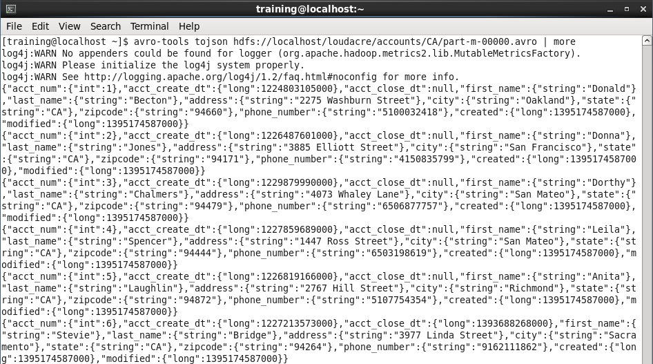
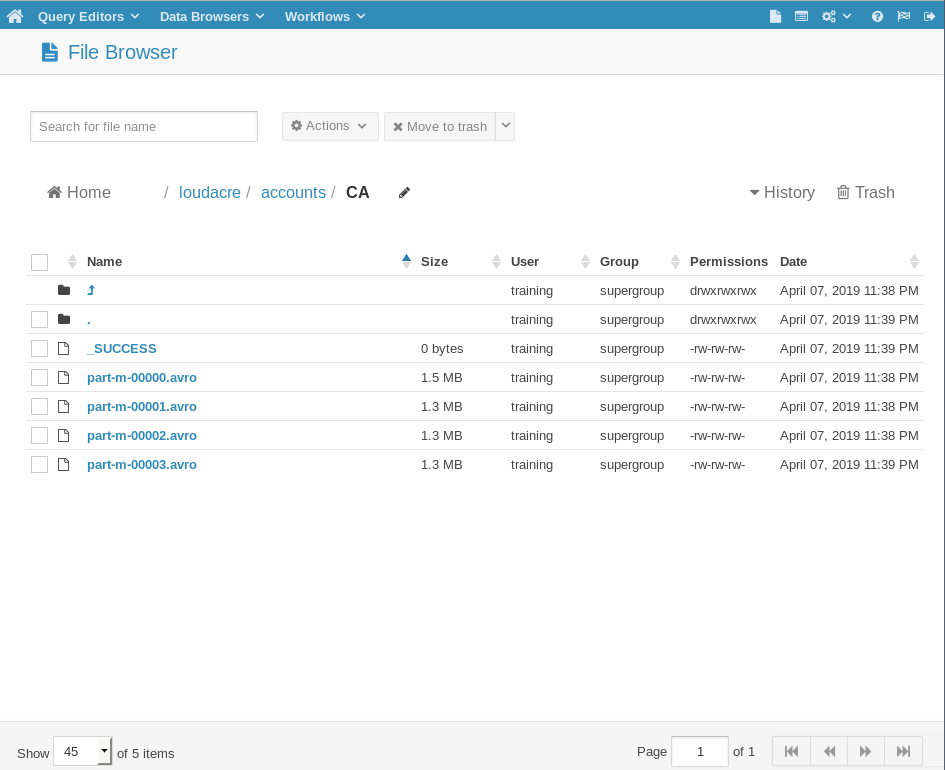

# Sqoop Exercise

### 1. From the accounts table, import only the primary key, along with the first name, last name to HDFS directory /loudacre/accounts/user_info. Please save the file in text format with tab delimiters.

  **Hint**: You will have to figure out what the name of the table columns are in order to complete this exercise.

  A. Look up table `accounts` and find out primary key, first name and last name columns.
  ```
[training@localhost ~]$ sqoop eval --connect jdbc:mysql://localhost/loudacre --username training --password training --query "DESCRIBE accounts"
19/04/07 22:11:19 INFO sqoop.Sqoop: Running Sqoop version: 1.4.6-cdh5.7.0
19/04/07 22:11:19 WARN tool.BaseSqoopTool: Setting your password on the command-line is insecure. Consider using -P instead.
19/04/07 22:11:19 INFO manager.MySQLManager: Preparing to use a MySQL streaming resultset.
---------------------------------------------------------------------------------------------------------
| Field                | Type                 | Null | Key | Default              | Extra                |
---------------------------------------------------------------------------------------------------------
| acct_num             | int(11)              | NO  | PRI | (null)               |                      |
| acct_create_dt       | datetime             | NO  |     | (null)               |                      |
| acct_close_dt        | datetime             | YES |     | (null)               |                      |
| first_name           | varchar(255)         | NO  |     | (null)               |                      |
| last_name            | varchar(255)         | NO  |     | (null)               |                      |
| address              | varchar(255)         | NO  |     | (null)               |                      |
| city                 | varchar(255)         | NO  |     | (null)               |                      |
| state                | varchar(255)         | NO  |     | (null)               |                      |
| zipcode              | varchar(255)         | NO  |     | (null)               |                      |
| phone_number         | varchar(255)         | NO  |     | (null)               |                      |
| created              | datetime             | NO  |     | (null)               |                      |
| modified             | datetime             | NO  |     | (null)               |                      |
---------------------------------------------------------------------------------------------------------
  ```
  * Primary Key: acct_num
  * First Name: first_name
  * Last Name: last_name

  B. Import the table `accounts`
  ```
[training@localhost ~]$ sqoop import \
> --table accounts \
> --connect jdbc:mysql://localhost/loudacre \
> --username training --password training \
> --columns "acct_num,first_name,last_name" \
> --target-dir /loudacre/accounts/user_info \
> --fields-terminated-by "\t" \
> --as-textfile
19/04/07 22:15:49 INFO sqoop.Sqoop: Running Sqoop version: 1.4.6-cdh5.7.0
19/04/07 22:15:49 WARN tool.BaseSqoopTool: Setting your password on the command-line is insecure. Consider using -P instead.
19/04/07 22:15:50 INFO manager.MySQLManager: Preparing to use a MySQL streaming resultset.
19/04/07 22:15:50 INFO tool.CodeGenTool: Beginning code generation
19/04/07 22:15:50 INFO manager.SqlManager: Executing SQL statement: SELECT t.* FROM `accounts` AS t LIMIT 1
19/04/07 22:15:50 INFO manager.SqlManager: Executing SQL statement: SELECT t.* FROM `accounts` AS t LIMIT 1
19/04/07 22:15:50 INFO orm.CompilationManager: HADOOP_MAPRED_HOME is /usr/lib/hadoop-mapreduce
Note: /tmp/sqoop-training/compile/865ae3ba639bb6d4e8c1ed465b10881d/accounts.java uses or overrides a deprecated API.
Note: Recompile with -Xlint:deprecation for details.
19/04/07 22:15:52 INFO orm.CompilationManager: Writing jar file: /tmp/sqoop-training/compile/865ae3ba639bb6d4e8c1ed465b10881d/accounts.jar
19/04/07 22:15:52 WARN manager.MySQLManager: It looks like you are importing from mysql.
19/04/07 22:15:52 WARN manager.MySQLManager: This transfer can be faster! Use the --direct
19/04/07 22:15:52 WARN manager.MySQLManager: option to exercise a MySQL-specific fast path.
19/04/07 22:15:52 INFO manager.MySQLManager: Setting zero DATETIME behavior to convertToNull (mysql)
19/04/07 22:15:52 INFO mapreduce.ImportJobBase: Beginning import of accounts
19/04/07 22:15:52 INFO Configuration.deprecation: mapred.job.tracker is deprecated. Instead, use mapreduce.jobtracker.address
19/04/07 22:15:52 INFO Configuration.deprecation: mapred.jar is deprecated. Instead, use mapreduce.job.jar
19/04/07 22:15:53 INFO Configuration.deprecation: mapred.map.tasks is deprecated. Instead, use mapreduce.job.maps
19/04/07 22:15:53 INFO client.RMProxy: Connecting to ResourceManager at /0.0.0.0:8032
19/04/07 22:15:55 INFO db.DBInputFormat: Using read commited transaction isolation
19/04/07 22:15:55 INFO db.DataDrivenDBInputFormat: BoundingValsQuery: SELECT MIN(`acct_num`), MAX(`acct_num`) FROM `accounts`
19/04/07 22:15:55 INFO db.IntegerSplitter: Split size: 32440; Num splits: 4 from: 1 to: 129761
19/04/07 22:15:55 INFO mapreduce.JobSubmitter: number of splits:4
19/04/07 22:15:55 INFO mapreduce.JobSubmitter: Submitting tokens for job: job_1554697449343_0004
19/04/07 22:15:56 INFO impl.YarnClientImpl: Submitted application application_1554697449343_0004
19/04/07 22:15:56 INFO mapreduce.Job: The url to track the job: http://localhost:8088/proxy/application_1554697449343_0004/
19/04/07 22:15:56 INFO mapreduce.Job: Running job: job_1554697449343_0004
19/04/07 22:16:03 INFO mapreduce.Job: Job job_1554697449343_0004 running in uber mode : false
19/04/07 22:16:03 INFO mapreduce.Job:  map 0% reduce 0%
19/04/07 22:16:10 INFO mapreduce.Job:  map 25% reduce 0%
19/04/07 22:16:15 INFO mapreduce.Job:  map 50% reduce 0%
19/04/07 22:16:20 INFO mapreduce.Job:  map 75% reduce 0%
19/04/07 22:16:25 INFO mapreduce.Job:  map 100% reduce 0%
19/04/07 22:16:25 INFO mapreduce.Job: Job job_1554697449343_0004 completed successfully
19/04/07 22:16:26 INFO mapreduce.Job: Counters: 30
	File System Counters
		FILE: Number of bytes read=0
		FILE: Number of bytes written=560464
		FILE: Number of read operations=0
		FILE: Number of large read operations=0
		FILE: Number of write operations=0
		HDFS: Number of bytes read=470
		HDFS: Number of bytes written=2615920
		HDFS: Number of read operations=16
		HDFS: Number of large read operations=0
		HDFS: Number of write operations=8
	Job Counters
		Launched map tasks=4
		Other local map tasks=4
		Total time spent by all maps in occupied slots (ms)=0
		Total time spent by all reduces in occupied slots (ms)=0
		Total time spent by all map tasks (ms)=15607
		Total vcore-seconds taken by all map tasks=15607
		Total megabyte-seconds taken by all map tasks=3995392
	Map-Reduce Framework
		Map input records=129761
		Map output records=129761
		Input split bytes=470
		Spilled Records=0
		Failed Shuffles=0
		Merged Map outputs=0
		GC time elapsed (ms)=219
		CPU time spent (ms)=3590
		Physical memory (bytes) snapshot=501219328
		Virtual memory (bytes) snapshot=8262221824
		Total committed heap usage (bytes)=251920384
	File Input Format Counters
		Bytes Read=0
	File Output Format Counters
		Bytes Written=2615920
19/04/07 22:16:26 INFO mapreduce.ImportJobBase: Transferred 2.4947 MB in 32.4027 seconds (78.8393 KB/sec)
19/04/07 22:16:26 INFO mapreduce.ImportJobBase: Retrieved 129761 records.
  ```

### 2. This time save the same in parquet format with snappy compression. Save it in /loudacre/accounts/user_compressed. Provide.a screenshot of HUE with the new directory created.
  ```
[training@localhost ~]$ sqoop import \
> --table accounts \
> --connect jdbc:mysql://localhost/loudacre \
> --username training --password training \
> --columns "acct_num,first_name,last_name" \
> --target-dir /loudacre/accounts/user_compressed \
> --compression-codec org.apache.hadoop.io.compress.SnappyCodec \
> --as-parquetfile
19/04/07 22:20:32 INFO sqoop.Sqoop: Running Sqoop version: 1.4.6-cdh5.7.0
19/04/07 22:20:32 WARN tool.BaseSqoopTool: Setting your password on the command-line is insecure. Consider using -P instead.
19/04/07 22:20:33 INFO manager.MySQLManager: Preparing to use a MySQL streaming resultset.
19/04/07 22:20:33 INFO tool.CodeGenTool: Beginning code generation
19/04/07 22:20:33 INFO tool.CodeGenTool: Will generate java class as codegen_accounts
19/04/07 22:20:33 INFO manager.SqlManager: Executing SQL statement: SELECT t.* FROM `accounts` AS t LIMIT 1
19/04/07 22:20:33 INFO manager.SqlManager: Executing SQL statement: SELECT t.* FROM `accounts` AS t LIMIT 1
19/04/07 22:20:33 INFO orm.CompilationManager: HADOOP_MAPRED_HOME is /usr/lib/hadoop-mapreduce
Note: /tmp/sqoop-training/compile/21d273dadc794ecdc80f7edc06d6a915/codegen_accounts.java uses or overrides a deprecated API.
Note: Recompile with -Xlint:deprecation for details.
19/04/07 22:20:35 INFO orm.CompilationManager: Writing jar file: /tmp/sqoop-training/compile/21d273dadc794ecdc80f7edc06d6a915/codegen_accounts.jar
19/04/07 22:20:35 WARN manager.MySQLManager: It looks like you are importing from mysql.
19/04/07 22:20:35 WARN manager.MySQLManager: This transfer can be faster! Use the --direct
19/04/07 22:20:35 WARN manager.MySQLManager: option to exercise a MySQL-specific fast path.
19/04/07 22:20:35 INFO manager.MySQLManager: Setting zero DATETIME behavior to convertToNull (mysql)
19/04/07 22:20:35 INFO mapreduce.ImportJobBase: Beginning import of accounts
19/04/07 22:20:35 INFO Configuration.deprecation: mapred.job.tracker is deprecated. Instead, use mapreduce.jobtracker.address
19/04/07 22:20:35 INFO Configuration.deprecation: mapred.jar is deprecated. Instead, use mapreduce.job.jar
19/04/07 22:20:36 INFO manager.SqlManager: Executing SQL statement: SELECT t.* FROM `accounts` AS t LIMIT 1
19/04/07 22:20:36 INFO manager.SqlManager: Executing SQL statement: SELECT t.* FROM `accounts` AS t LIMIT 1
19/04/07 22:20:38 INFO Configuration.deprecation: mapred.map.tasks is deprecated. Instead, use mapreduce.job.maps
19/04/07 22:20:38 INFO client.RMProxy: Connecting to ResourceManager at /0.0.0.0:8032
19/04/07 22:20:40 INFO db.DBInputFormat: Using read commited transaction isolation
19/04/07 22:20:40 INFO db.DataDrivenDBInputFormat: BoundingValsQuery: SELECT MIN(`acct_num`), MAX(`acct_num`) FROM `accounts`
19/04/07 22:20:40 INFO db.IntegerSplitter: Split size: 32440; Num splits: 4 from: 1 to: 129761
19/04/07 22:20:40 INFO mapreduce.JobSubmitter: number of splits:4
19/04/07 22:20:40 INFO mapreduce.JobSubmitter: Submitting tokens for job: job_1554697449343_0005
19/04/07 22:20:40 INFO impl.YarnClientImpl: Submitted application application_1554697449343_0005
19/04/07 22:20:40 INFO mapreduce.Job: The url to track the job: http://localhost:8088/proxy/application_1554697449343_0005/
19/04/07 22:20:40 INFO mapreduce.Job: Running job: job_1554697449343_0005
19/04/07 22:20:48 INFO mapreduce.Job: Job job_1554697449343_0005 running in uber mode : false
19/04/07 22:20:48 INFO mapreduce.Job:  map 0% reduce 0%
19/04/07 22:20:57 INFO mapreduce.Job:  map 25% reduce 0%
19/04/07 22:21:05 INFO mapreduce.Job:  map 50% reduce 0%
19/04/07 22:21:13 INFO mapreduce.Job:  map 75% reduce 0%
19/04/07 22:21:21 INFO mapreduce.Job:  map 100% reduce 0%
19/04/07 22:21:21 INFO mapreduce.Job: Job job_1554697449343_0005 completed successfully
19/04/07 22:21:21 INFO mapreduce.Job: Counters: 30
	File System Counters
		FILE: Number of bytes read=0
		FILE: Number of bytes written=565912
		FILE: Number of read operations=0
		FILE: Number of large read operations=0
		FILE: Number of write operations=0
		HDFS: Number of bytes read=25234
		HDFS: Number of bytes written=1305047
		HDFS: Number of read operations=272
		HDFS: Number of large read operations=0
		HDFS: Number of write operations=40
	Job Counters
		Launched map tasks=4
		Other local map tasks=4
		Total time spent by all maps in occupied slots (ms)=0
		Total time spent by all reduces in occupied slots (ms)=0
		Total time spent by all map tasks (ms)=24638
		Total vcore-seconds taken by all map tasks=24638
		Total megabyte-seconds taken by all map tasks=6307328
	Map-Reduce Framework
		Map input records=129761
		Map output records=129761
		Input split bytes=470
		Spilled Records=0
		Failed Shuffles=0
		Merged Map outputs=0
		GC time elapsed (ms)=535
		CPU time spent (ms)=8550
		Physical memory (bytes) snapshot=664793088
		Virtual memory (bytes) snapshot=8296660992
		Total committed heap usage (bytes)=251920384
	File Input Format Counters
		Bytes Read=0
	File Output Format Counters
		Bytes Written=0
19/04/07 22:21:21 INFO mapreduce.ImportJobBase: Transferred 1.2446 MB in 43.4274 seconds (29.3469 KB/sec)
19/04/07 22:21:21 INFO mapreduce.ImportJobBase: Retrieved 129761 records.
  ```
  

### 3. Finally save in /loudacre/accounts/CA only clients whose state is from California. Save the file in avro format and compressed using snappy. From the terminal, display some of the records that you just imported. Take a screenshot and save it as CA_only.

  A. Import data to HDFS directory /loudacre/accounts/CA
  ```
  [training@localhost ~]$ sqoop import \
  > --table accounts \
  > --connect jdbc:mysql://localhost/loudacre \
  > --username training --password training \
  > --target-dir /loudacre/accounts/CA \
  > --where "state='CA'" \
  > --compression-codec org.apache.hadoop.io.compress.SnappyCodec \
  > --as-avrodatafile

  19/04/07 23:38:23 INFO sqoop.Sqoop: Running Sqoop version: 1.4.6-cdh5.7.0
  19/04/07 23:38:23 WARN tool.BaseSqoopTool: Setting your password on the command-line is insecure. Consider using -P instead.
  19/04/07 23:38:23 INFO manager.MySQLManager: Preparing to use a MySQL streaming resultset.
  19/04/07 23:38:23 INFO tool.CodeGenTool: Beginning code generation
  19/04/07 23:38:24 INFO manager.SqlManager: Executing SQL statement: SELECT t.* FROM `accounts` AS t LIMIT 1
  19/04/07 23:38:24 INFO manager.SqlManager: Executing SQL statement: SELECT t.* FROM `accounts` AS t LIMIT 1
  19/04/07 23:38:24 INFO orm.CompilationManager: HADOOP_MAPRED_HOME is /usr/lib/hadoop-mapreduce
  Note: /tmp/sqoop-training/compile/ca934139f389cfc7424880b37d582b62/accounts.java uses or overrides a deprecated API.
  Note: Recompile with -Xlint:deprecation for details.
  19/04/07 23:38:27 INFO orm.CompilationManager: Writing jar file: /tmp/sqoop-training/compile/ca934139f389cfc7424880b37d582b62/accounts.jar
  19/04/07 23:38:27 WARN manager.MySQLManager: It looks like you are importing from mysql.
  19/04/07 23:38:27 WARN manager.MySQLManager: This transfer can be faster! Use the --direct
  19/04/07 23:38:27 WARN manager.MySQLManager: option to exercise a MySQL-specific fast path.
  19/04/07 23:38:27 INFO manager.MySQLManager: Setting zero DATETIME behavior to convertToNull (mysql)
  19/04/07 23:38:27 INFO mapreduce.ImportJobBase: Beginning import of accounts
  19/04/07 23:38:27 INFO Configuration.deprecation: mapred.job.tracker is deprecated. Instead, use mapreduce.jobtracker.address
  19/04/07 23:38:27 INFO Configuration.deprecation: mapred.jar is deprecated. Instead, use mapreduce.job.jar
  19/04/07 23:38:28 INFO manager.SqlManager: Executing SQL statement: SELECT t.* FROM `accounts` AS t LIMIT 1
  19/04/07 23:38:28 INFO manager.SqlManager: Executing SQL statement: SELECT t.* FROM `accounts` AS t LIMIT 1
  19/04/07 23:38:28 INFO mapreduce.DataDrivenImportJob: Writing Avro schema file: /tmp/sqoop-training/compile/ca934139f389cfc7424880b37d582b62/accounts.avsc
  19/04/07 23:38:28 INFO Configuration.deprecation: mapred.map.tasks is deprecated. Instead, use mapreduce.job.maps
  19/04/07 23:38:28 INFO client.RMProxy: Connecting to ResourceManager at /0.0.0.0:8032
  19/04/07 23:38:30 INFO db.DBInputFormat: Using read commited transaction isolation
  19/04/07 23:38:30 INFO db.DataDrivenDBInputFormat: BoundingValsQuery: SELECT MIN(`acct_num`), MAX(`acct_num`) FROM `accounts` WHERE ( state='CA' )
  19/04/07 23:38:30 INFO db.IntegerSplitter: Split size: 32439; Num splits: 4 from: 1 to: 129760
  19/04/07 23:38:30 INFO mapreduce.JobSubmitter: number of splits:4
  19/04/07 23:38:31 INFO mapreduce.JobSubmitter: Submitting tokens for job: job_1554697449343_0007
  19/04/07 23:38:31 INFO impl.YarnClientImpl: Submitted application application_1554697449343_0007
  19/04/07 23:38:31 INFO mapreduce.Job: The url to track the job: http://localhost:8088/proxy/application_1554697449343_0007/
  19/04/07 23:38:31 INFO mapreduce.Job: Running job: job_1554697449343_0007
  19/04/07 23:38:39 INFO mapreduce.Job: Job job_1554697449343_0007 running in uber mode : false
  19/04/07 23:38:39 INFO mapreduce.Job:  map 0% reduce 0%
  19/04/07 23:38:48 INFO mapreduce.Job:  map 25% reduce 0%
  19/04/07 23:38:55 INFO mapreduce.Job:  map 50% reduce 0%
  19/04/07 23:39:02 INFO mapreduce.Job:  map 75% reduce 0%
  19/04/07 23:39:09 INFO mapreduce.Job:  map 100% reduce 0%
  19/04/07 23:39:09 INFO mapreduce.Job: Job job_1554697449343_0007 completed successfully
  19/04/07 23:39:09 INFO mapreduce.Job: Counters: 30
  	File System Counters
  		FILE: Number of bytes read=0
  		FILE: Number of bytes written=566924
  		FILE: Number of read operations=0
  		FILE: Number of large read operations=0
  		FILE: Number of write operations=0
  		HDFS: Number of bytes read=470
  		HDFS: Number of bytes written=5669076
  		HDFS: Number of read operations=16
  		HDFS: Number of large read operations=0
  		HDFS: Number of write operations=8
  	Job Counters
  		Launched map tasks=4
  		Other local map tasks=4
  		Total time spent by all maps in occupied slots (ms)=0
  		Total time spent by all reduces in occupied slots (ms)=0
  		Total time spent by all map tasks (ms)=22931
  		Total vcore-seconds taken by all map tasks=22931
  		Total megabyte-seconds taken by all map tasks=5870336
  	Map-Reduce Framework
  		Map input records=92416
  		Map output records=92416
  		Input split bytes=470
  		Spilled Records=0
  		Failed Shuffles=0
  		Merged Map outputs=0
  		GC time elapsed (ms)=409
  		CPU time spent (ms)=10920
  		Physical memory (bytes) snapshot=606470144
  		Virtual memory (bytes) snapshot=8283291648
  		Total committed heap usage (bytes)=251920384
  	File Input Format Counters
  		Bytes Read=0
  	File Output Format Counters
  		Bytes Written=5669076
  19/04/07 23:39:09 INFO mapreduce.ImportJobBase: Transferred 5.4065 MB in 40.7503 seconds (135.8569 KB/sec)
  19/04/07 23:39:09 INFO mapreduce.ImportJobBase: Retrieved 92416 records.
  ```

  B. Display imported data by avro-tools.
  ```
  [training@localhost ~]$ avro-tools tojson hdfs://localhost/loudacre/accounts/CA/part-m-00000.avro | more
  log4j:WARN No appenders could be found for logger (org.apache.hadoop.metrics2.lib.MutableMetricsFactory).
  log4j:WARN Please initialize the log4j system properly.
  log4j:WARN See http://logging.apache.org/log4j/1.2/faq.html#noconfig for more info.
  {"acct_num":{"int":1},"acct_create_dt":{"long":1224803105000},"acct_close_dt":null,"first_name":{"string":"Donald"}
  ,"last_name":{"string":"Becton"},"address":{"string":"2275 Washburn Street"},"city":{"string":"Oakland"},"state":{"
  string":"CA"},"zipcode":{"string":"94660"},"phone_number":{"string":"5100032418"},"created":{"long":1395174587000},
  "modified":{"long":1395174587000}}
  {"acct_num":{"int":2},"acct_create_dt":{"long":1226487601000},"acct_close_dt":null,"first_name":{"string":"Donna"},
  "last_name":{"string":"Jones"},"address":{"string":"3885 Elliott Street"},"city":{"string":"San Francisco"},"state"
  :{"string":"CA"},"zipcode":{"string":"94171"},"phone_number":{"string":"4150835799"},"created":{"long":139517458700
  0},"modified":{"long":1395174587000}}
  {"acct_num":{"int":3},"acct_create_dt":{"long":1229879990000},"acct_close_dt":null,"first_name":{"string":"Dorthy"}
  ,"last_name":{"string":"Chalmers"},"address":{"string":"4073 Whaley Lane"},"city":{"string":"San Mateo"},"state":{"
  string":"CA"},"zipcode":{"string":"94479"},"phone_number":{"string":"6506877757"},"created":{"long":1395174587000},
  "modified":{"long":1395174587000}}
  {"acct_num":{"int":4},"acct_create_dt":{"long":1227859689000},"acct_close_dt":null,"first_name":{"string":"Leila"},
  "last_name":{"string":"Spencer"},"address":{"string":"1447 Ross Street"},"city":{"string":"San Mateo"},"state":{"st
  ring":"CA"},"zipcode":{"string":"94444"},"phone_number":{"string":"6503198619"},"created":{"long":1395174587000},"m
  odified":{"long":1395174587000}}
  {"acct_num":{"int":5},"acct_create_dt":{"long":1226819166000},"acct_close_dt":null,"first_name":{"string":"Anita"},
  "last_name":{"string":"Laughlin"},"address":{"string":"2767 Hill Street"},"city":{"string":"Richmond"},"state":{"st
  ring":"CA"},"zipcode":{"string":"94872"},"phone_number":{"string":"5107754354"},"created":{"long":1395174587000},"m
  odified":{"long":1395174587000}}
  {"acct_num":{"int":6},"acct_create_dt":{"long":1227213573000},"acct_close_dt":{"long":1393688268000},"first_name":{
  "string":"Stevie"},"last_name":{"string":"Bridge"},"address":{"string":"3977 Linda Street"},"city":{"string":"Sacra
  mento"},"state":{"string":"CA"},"zipcode":{"string":"94264"},"phone_number":{"string":"9162111862"},"created":{"lon
  g":1395174587000},"modified":{"long":1395174587000}}
  ```
  
  
